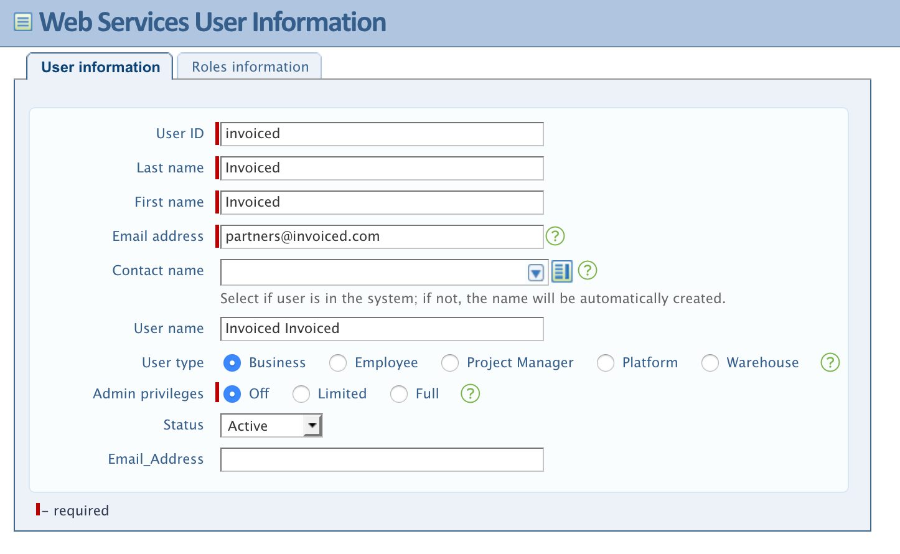

# Sage Intacct

Invoiced integrates with Sage Intacct out of the box, a best-in-class cloud ERP. This document outlines how to setup and use the Intacct integration.

## Setup

Please follow these steps to set up the Intacct integration.

### Finding Your Intacct Company ID

Your Intacct company ID is required in order to connect the integration. You can obtain your company ID from Intacct with these steps:

1. Within the Intacct application, hover over the **Company** tab and click **Company Info**.

2. You should see an *ID* field. This is the company ID that you will use in the connection steps below.

### Setting Up a Web Services User

The next step is to set up a web services user for Invoiced on Intacct. It is recommended that you use a dedicated web services user for Invoiced in order to ensure it has the correct permissions. We also recommend against using a non-web services user because any password changes would break the integration.

1. You need to ensure that your company has web services enabled in **Company** > **Subscriptions** in the Intacct application.

2. Within the Intacct application, hover over the **Company** tab and click the **+** button next to *Users*.

3. You will want to set up a user similar to the screenshot below with the following settings:

   - User ID: "invoiced"
   - First Name / Last Name: "Invoiced"
   - Email address: your shared accounting team email
   - User type: "Business"
   - Admin privileges: "Full"
   - Status: "Active"
   - Keep password until admin resets it: check this box
   - Restrict user access to web services only: check this box
   
   

4. Next you need to configure permissions for the Invoiced user. On the subscriptions page check the **Accounts Receivable** module.

   

5. Click on the **Permissions** button next to the Accounts Receivable module. Select the **All** radio in the top right. Click **Save**.

   

6. Click **Save** on the subscriptions page. You should have received an email with the username and password information.

### Connecting Intacct on Invoiced

1. Go to **Settings** > **Integrations** in the Invoiced dashboard.

   

2. Click on **Connect** on the Intacct integration.

   

3. Enter in the Intacct company ID, username, and password for your Invoiced web services user created earlier.

4. Click **Save**. Intacct is now connected! Next you will likely want to configure the integration before using it.

   

### Configuring the Accounting Sync

Now you can configure the accounting sync in order to tell Invoiced how to map the data into your general ledger.

1. Click on **Configure** on the Intacct integration from the integrations page.

   

2. Enter in the item account label from your G/L on Intacct. This is the default account where new line items are mapped.

3. Enter in the undeposited funds account label from your G/L on Intacct. This is where payments received through Invoiced will be mapped.

4. You can optionally enter in a location ID and/or department ID if you are operating a multi-entity Intacct company.