# NetSuite

Invoiced integrates with NetSuite out of the box, a cloud-based ERP system. This document outlines how to setup and use the NetSuite integration.

## Overview

The NetSuite integration ships with the following capabilities:

- Importing outstanding invoices from NetSuite
- Importing customers from NetSuite
- Writing invoices generated on Invoiced to NetSuite
- Reconciling payments received on Invoiced to NetSuite
- Syncing payments recorded on NetSuite to Invoiced

[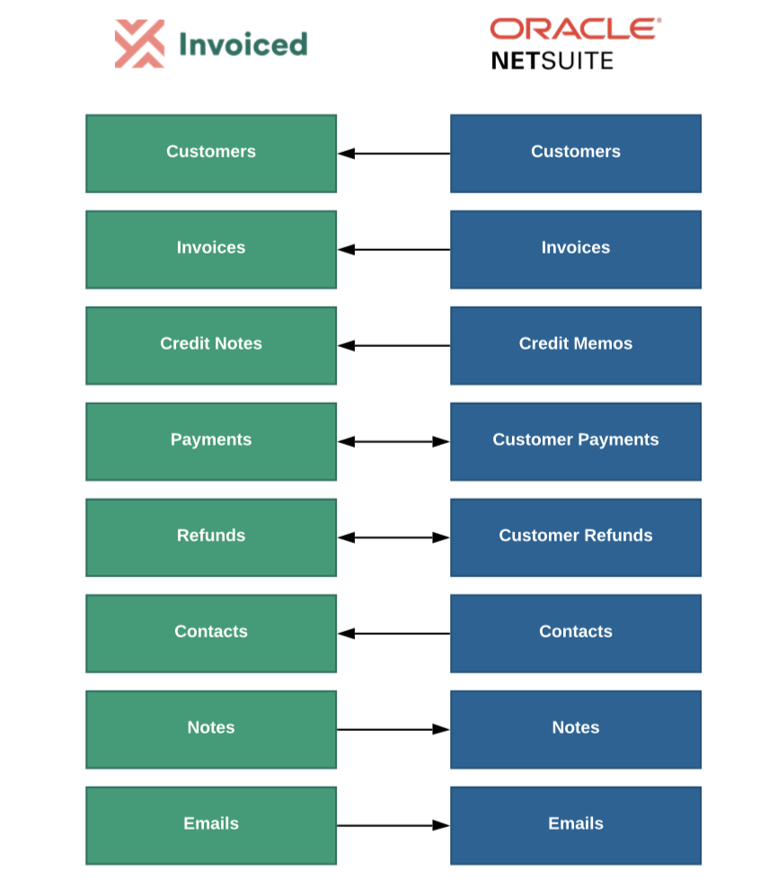](../img/netsuite-object-mapping.png)

## Setup

In order to set up the NetSuite integration you first need these pieces of information:
- NetSuite Account ID
- OAuth Access Token

Below we will show you how to connect NetSuite with Invoiced, step-by-step.

### Setting Up an OAuth Access Token

The next step is to create an OAuth Access Token for Invoiced on NetSuite.

Coming Soon!

### Connecting NetSuite on Invoiced

1. Go to **Settings** > **Integrations** in the Invoiced dashboard.

   

2. Click on **Connect** on the NetSuite integration.

   [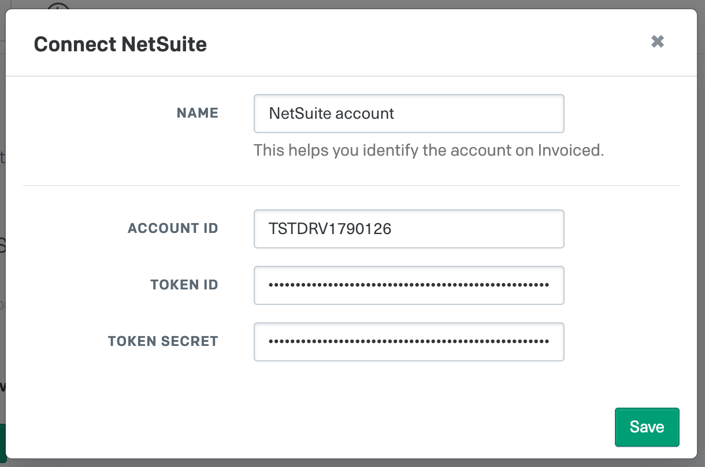](../img/connect-netsuite.png)

3. Enter in the NetSuite account ID, consumer secret, consumer key, token, and token secret for the Invoiced integration created earlier.

4. Click **Save**. NetSuite is now connected! Next you will want to configure the integration before using it.

   [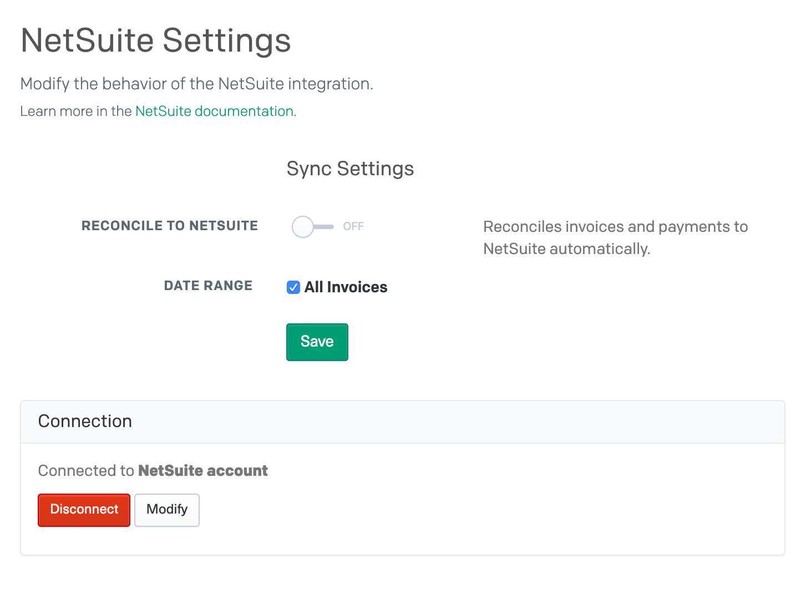](../img/netsuite-integration-settings.png)

5. You can customize the integration, including enabling automatic reconciliation. Click **Save** to finish setting up the NetSuite integration.

## Usage

In this section you will learn how to use the NetSuite integration.

### Enabling Auto-Sync

Auto-sync will run accounting syncs automatically for you on an ongoing basis. Once auto-sync is enabled, accounting syncs will happen approximately once per hour. Here's how you can enable auto-sync:

1. Go to **Settings** > **Accounting Sync**. Click **Configure** on the NetSuite integration.

   

2. Enable the *Reconcile to NetSuite* option.

   [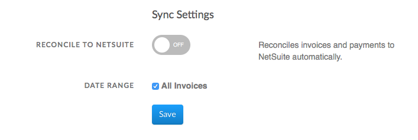](../img/netsuite-integration-settings-enable-auto-sync.png)

3. Click **Save**. You can periodically check back here to see when the next sync run is scheduled or see past activity in the *Recent Syncs* table.

   

### Running Syncs Manually

If you want control over when your books are synced then you can manually trigger accounting syncs. You can run an accounting sync by following these steps:

1. Go to **Settings** > **Accounting Sync**.

   

2. Click **Sync Now** underneath *NetSuite* any time you want to run an accounting sync. When the job is finished you will see it in the *Recent Syncs* table.

   [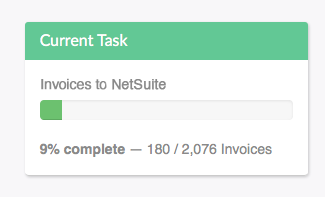](../img/netsuite-accounting-sync.png)

### Manual Invoice Imports

You can import outstanding invoices from NetSuite using the invoice importer.

Instructions:

1. Go to the **Invoices** tab in the Invoiced dashboard. Click on the **Import** button in the top-right.

   

2. Select **NetSuite**.

   

3. When ready to import, click **Start**.

   [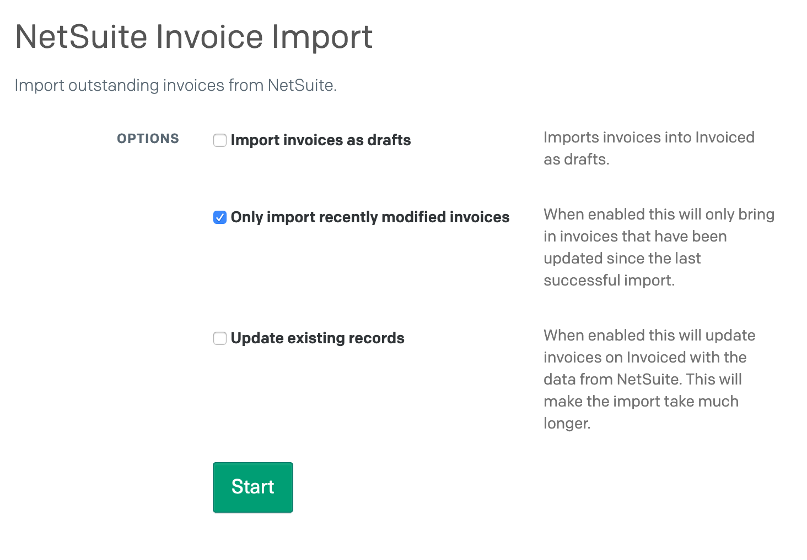](../img/netsuite-invoice-importer-options.png)

4. The importer will begin working. You are free to leave the page once the import starts. If you leave you will get an email afterwards with the result.

   [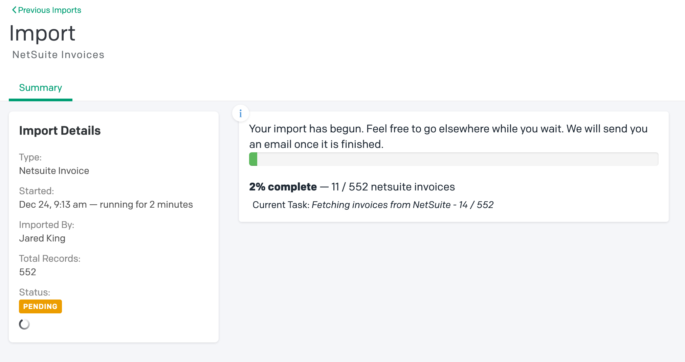](../img/netsuite-invoice-importer-pending.png)

5. Once the import is finished you will see the newly imported invoices on the **Invoices** page.

   [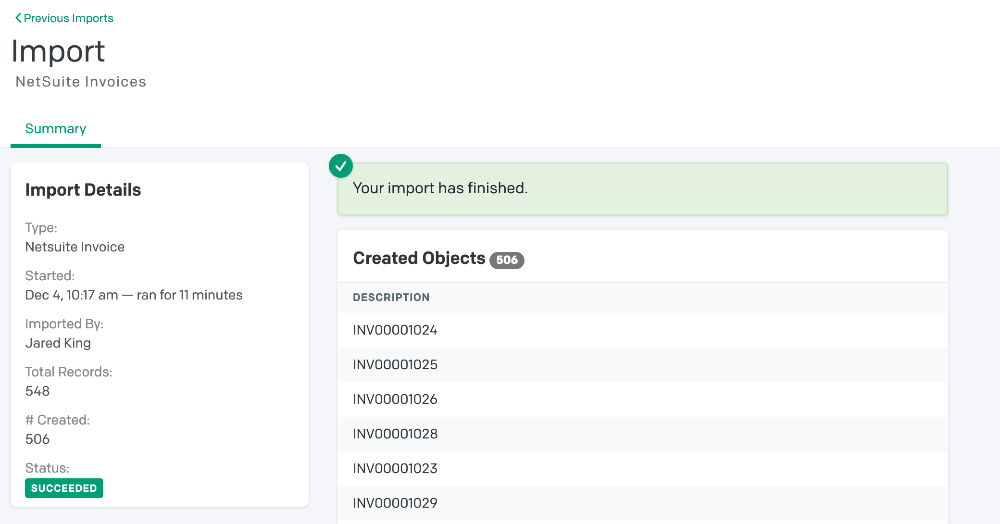](../img/netsuite-invoice-importer-finished.png)

### Manual Customer Imports

You can import customers from NetSuite into Invoiced as a one-time import. Why might you use this? The accounting sync will only import customers that have invoices, whereas a manual import will bring in your entire A/R customer list.

Instructions:

1. Go to the **Customers** tab in the Invoiced dashboard. Click on the **Import** button in the top-right.

   

2. Select **NetSuite**.

   

3. Click **Start**.

   [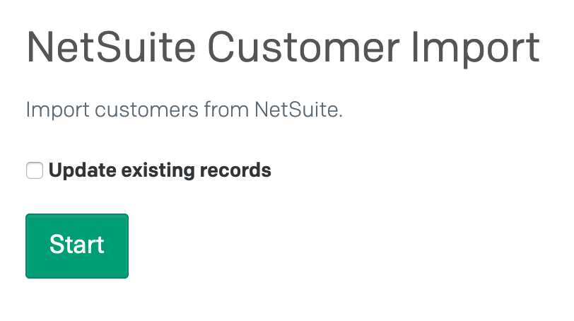](../img/netsuite-customer-importer.png)

4. The importer will begin working. You are free to leave the page once the import starts. If you leave you will get an email afterwards with the result.

   [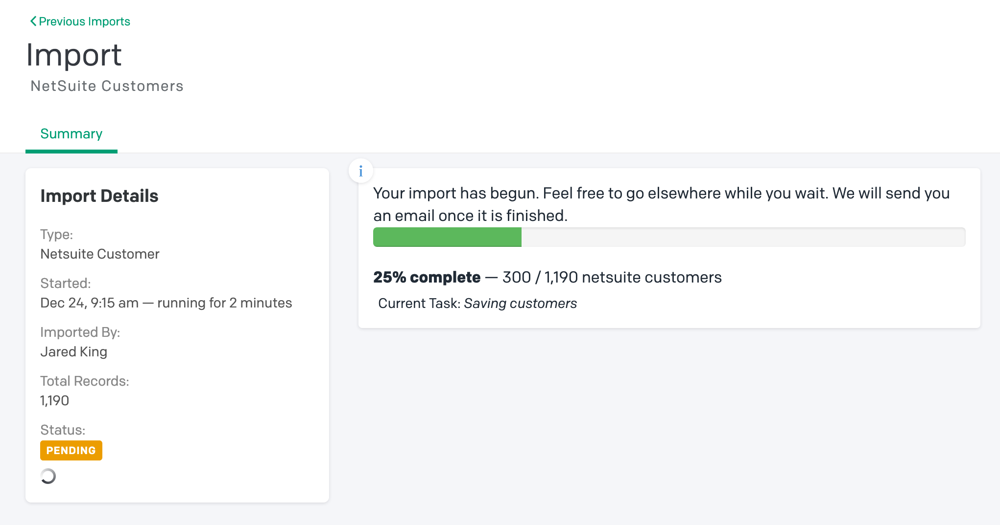](../img/netsuite-customer-importer-pending.png)

5. Once the import is finished you will see the newly imported invoices on the **Customers** page.

   [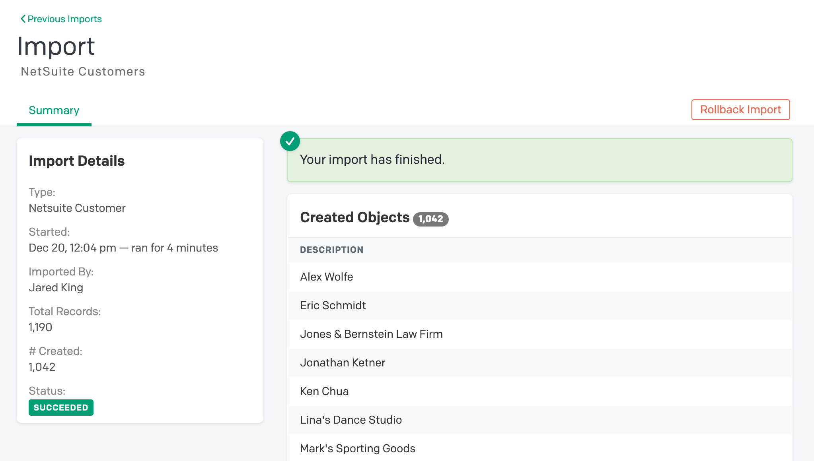](../img/netsuite-customer-importer-finished.png)

## Edge Cases

Here we have documented all of the limitations, nuances, and edge cases to be aware of when using the NetSuite integration.

- Customers on Invoiced are mapped to customers on NetSuite by the customer name.

- Only non-draft invoices on Invoiced that have been updated since the last sync will be synced. On your first sync this means that all non-draft invoices will be synced.

- Any changes to invoices imported from NetSuite that are later modified on Invoiced will not be synced to NetSuite. Payments processed through Invoiced for imported invoices will still be synced.

## Troubleshooting

When a sync fails you will be able to see the error message in the *Recent Syncs* section in **Settings** > **Accounting Sync**. Normally the error message will include the invoice # that failed and a detailed reason why it could not be synced. Oftentimes there is a manual action required on your end.

Below we have documented commonly encountered errors and recommended resolutions. If you are still unable to get your books synced then please contact [support@invoiced.com](mailto:support@invoiced.com) for further assistance.

### Finding Your NetSuite Account ID

Your NetSuite account ID is required in order to connect the integration. You can obtain your account ID from NetSuite with these steps:

1. Within the NetSuite application, hover over the **Setup** tab and click **Company** > **Company Information**.

2. You should see an *Account ID* field. This is the account ID that you will use in the connection steps.