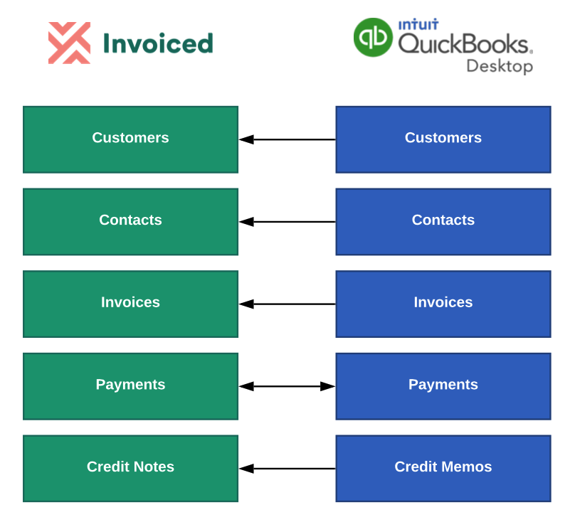
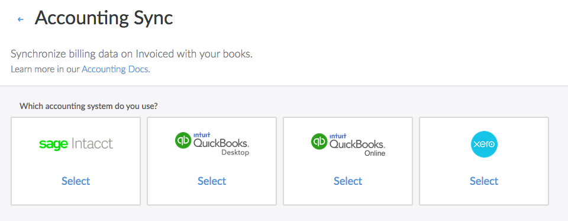
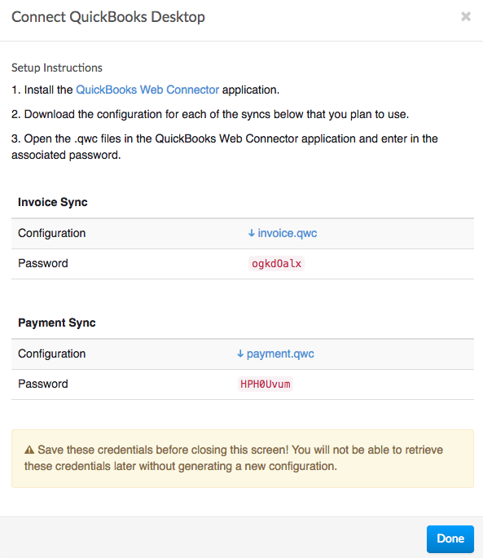
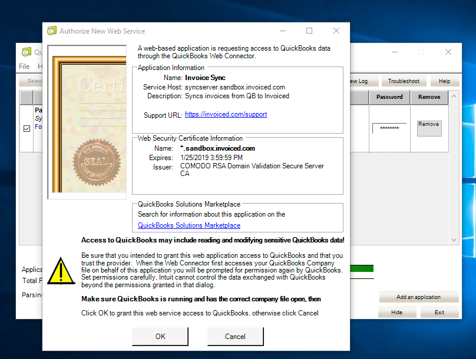
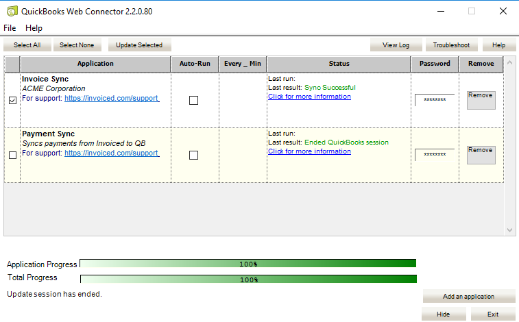
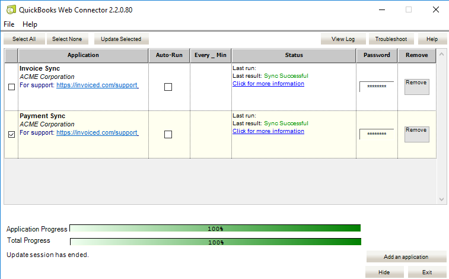
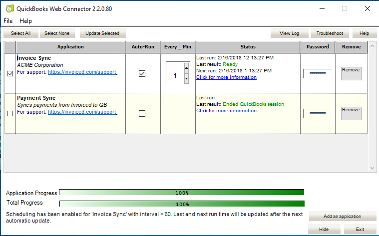
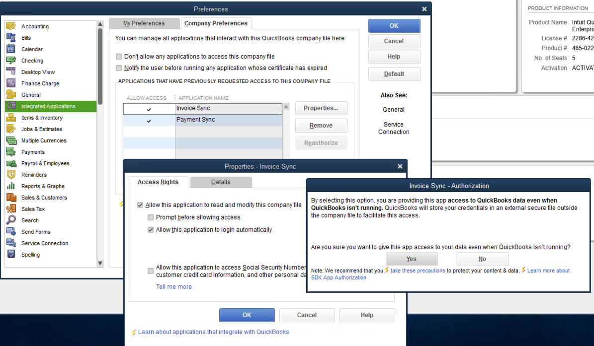

# QuickBooks Desktop

Invoiced integrates with QuickBooks Desktop out of the box to extend the billing capabilities of QuickBooks. This document describes how to set up the integration and how it works in detail.

## Overview

The QuickBooks Desktop integration ships with the following capabilities:

- Importing outstanding invoices from QuickBooks Desktop
- Importing customers from QuickBooks Desktop (when billed)
- Reconciling payments received on Invoiced to QuickBooks Desktop
- Syncing payments recorded on QuickBooks Desktop to Invoiced

## Supported QuickBooks Versions

The QuickBooks Desktop integration works with these versions of QuickBooks (Windows only).

- QuickBooks Enterprise Solutions (2015 or later)
- QuickBooks Premier (2015 or later)
- QuickBooks Pro (2015 or later)
- Canadian editions of QuickBooks (2015 or later)
- UK editions of QuickBooks (2015 or later)

## Setup

1. In order to begin syncing with QuickBooks Desktop first go to **Settings** > **Accounting Sync**.

   

2. Click on **Select** within the *QuickBooks Desktop* square.

   

3. Click on **Setup** to begin the setup process for QuickBooks Desktop.

   

4. Install [QuickBooks Web Connector](https://marketplace.intuit.com/webconnector/) on the computer where QuickBooks is installed, if you have not already.

5. Click **Generate QWC configuration**.

   

6. Download the `invoice.qwc` and `payment.qwc` files and open the each file in QuickBooks Web Connector.

  

7. Enter in the generated password for each sync you enable. Make sure you do this before closing the configuration screen on Invoiced because the password is irretrievable once you click **Done**.

## Usage

In this section you will learn how to use the QuickBooks Desktop integration.

### Syncing invoices

These are the steps to run an invoice sync. This will pull in any outstanding invoices from QuickBooks into Invoiced.

1. Open QuickBooks Web Connector.

2. Close any open windows on QuickBooks associated with the documents that will be synced.

3. Check *Invoice Sync* and click **Update Selected**.

4. When the sync has completed you should see your invoices on Invoiced.

   

### Syncing payments

These are the steps to run an invoice sync. This will push any payments received through Invoiced into QuickBooks and pull any payments received through QuickBooks into Invoiced.

1. Open QuickBooks Web Connector.

2. Close any open windows on QuickBooks associated with the documents that will be synced.

3. Check *Payment Sync* and click **Update Selected**.

4. When the sync has completed you should see your payments on QuickBooks.

   

### Turning on automatic syncing

You can tell QuickBooks Web Connector to run syncs automatically by turning on the **Auto-Run** setting and specifying how often you want the sync to run in the **Every_Min** box.

    

## Edge Cases

Here we have documented all of the limitations, nuances, and edge cases to be aware of when using the QuickBooks Desktop integration.

- Customers on Invoiced are mapped to customers on QuickBooks by the name. Please keep in mind that QuickBooks does not allow multiple customers with the same name, but Invoiced does allow duplicates.

- Any open credits on QuickBooks are applied to the open invoices before importing.  You can request this to be turned off by emailing support@invoiced.com.

- Modifications to invoices on Invoiced after they are synced will do nothing to the corresponding invoice in QuickBooks.

- Only payments processed through Invoiced are sent to QuickBooks. Offline payments recorded on Invoiced are not synced to QuickBooks. Any payments applied to invoices on QuickBooks are synced to Invoiced.

- Refunds are not currently synced. Any refunds initiated through Invoiced must be reconciled by hand.

## Troubleshooting

When a sync fails you will be able to see the error message in the *Recent Syncs* section in **Settings** > **Accounting Sync**. Normally the error message will include the invoice # that failed and a detailed reason why it could not be synced. Oftentimes there is a manual action required on your end.

Below we have documented commonly encountered errors and recommended resolutions. If you are still unable to get your books synced then please contact [support@invoiced.com](mailto:support@invoiced.com) for further assistance.

### Sync is not working

Please make sure you are connected to the internet in order to connect to Invoiced.

### Mismatched password

Every time you download a .qwc file please make sure you are using the associated password. Each time you generate a configuration this will generate a fresh password.

### Updating the .qwc file

If you are installing a new .qwc file, please make sure that you clear out the old sync first if you are replacing an existing sync.

### Error Messages

#### Could not start QuickBooks

You will run into this error if QuickBooks is not open, and you are running the sync through the web connector.  The remedy is to give the sync the ability to login automatically into QuickBooks, even when QuickBooks is closed.

In QuickBooks go to **Edit** > **Preferences** > **Integrated Applications** and then click **Properties** under the connected integration.  In the properties screen, choose "Allow this application to login automatically."  You will need to do this for the *Invoice Sync* and *Payment Sync*.

  

