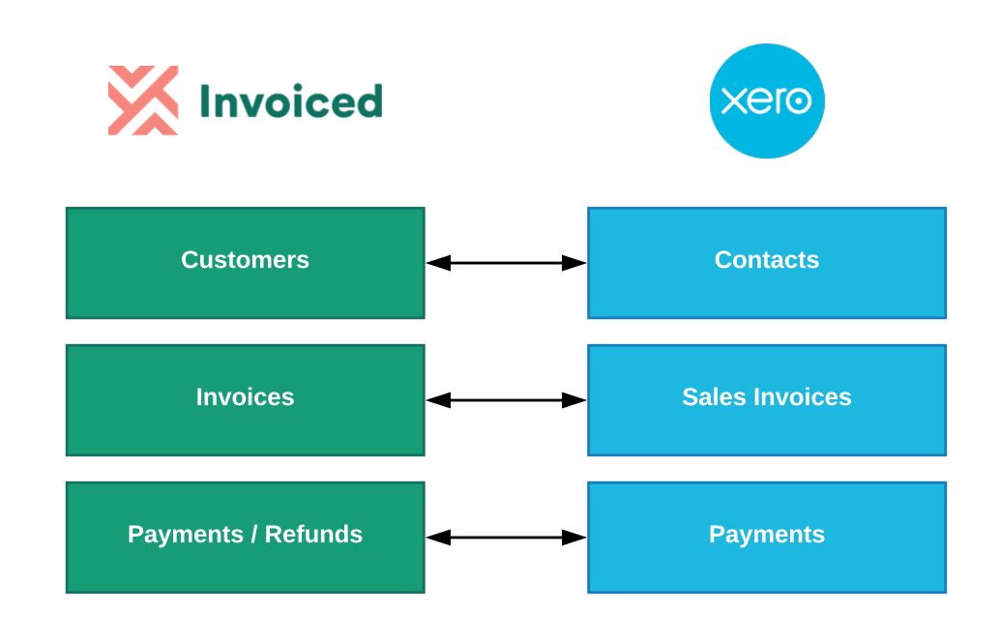
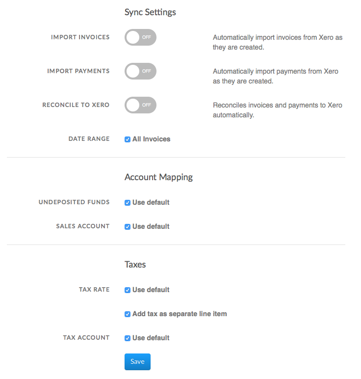
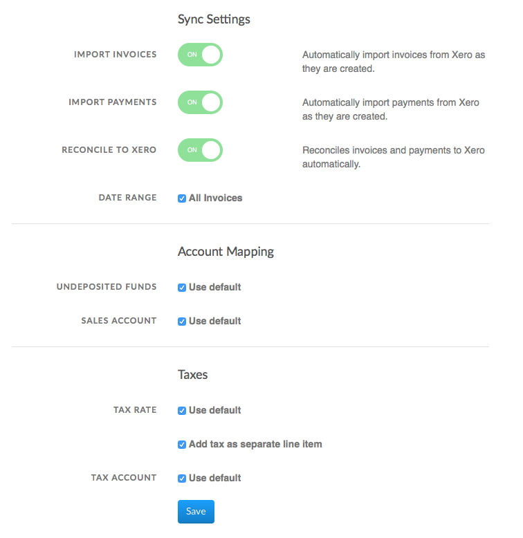
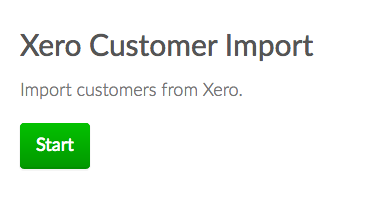
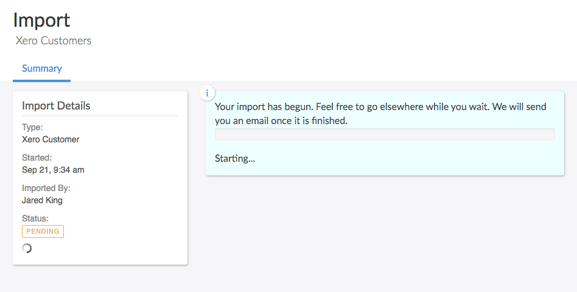

# Xero

Invoiced integrates with the Xero accounting system out of the box to supercharge the billing capabilities of Xero. This document describes how to set up the integration and how it works in detail.

## Overview

The Xero integration ships with the following capabilities:

- Importing outstanding invoices from Xero
- Importing contacts from Xero
- Writing invoices generated on Invoiced to Xero
- Reconciling payments received on Invoiced to Xero
- Syncing payments recorded on Xero to Invoiced

## Setup

1. In order to begin syncing with Xero first go to **Settings** > **Integrations**.  

   

2. Click on **Connect to Xero**. You will be redirected to Xero. You will need to sign in to Xero, if you are not already signed in.

   

3. Next you will be prompted to authorize Invoiced access to your Xero organization.  Click on **Authorize**.

   

4. You will be redirected back to Invoiced. Xero is now connected! Now you can configure the accounting sync in order to tell Invoiced how to map the data into your general ledger.

   

5. Change the account mapping and other settings. Click **Save**.

#### Account Mapping

Invoiced will create the following accounts in your G/L unless you specify an account for us to use:

- "Invoiced Bank Account" - bank account used for payments received on Invoiced
- "Invoiced Sales Account" - sales account used for line items
- "Invoiced Sales Tax Account" - sales account used for taxes received on Invoiced

#### Tax Rate Mapping

If you have not specified a tax rate in the integration settings, sync runs will attempt to match existing tax rates in Xero based on the name of the tax rate in Invoiced. If a tax rate with a matching name does not exist in Xero then the integration will create and use a tax rate called "Imported Invoiced Tax Rate".

## Usage

In this section you will learn how to use the Xero integration.

### Enabling Auto-Sync

Auto-sync will run accounting syncs automatically for you on an ongoing basis. Once auto-sync is enabled, accounting syncs will happen approximately once per hour. If you enable invoice and payment importing, those will happen in near real-time as those invoices and payments are created on Xero.

Here's how you can enable auto-sync:

1. Go to **Settings** > **Accounting Sync**. Click **Configure** on the Xero integration.

   

2. Enable the *Reconcile to Xero* option.

   

3. Click **Save**. You can periodically check back here to see when the next sync run is scheduled or see past activity in the *Recent Syncs* table.

   

### Running Syncs Manually

If you want control over when your books are synced then you can manually trigger accounting syncs. You can run an accounting sync by following these steps:

1. Go to **Settings** > **Accounting Sync**.

   

2. Click **Sync Now** underneath *Xero* any time you want to run an accounting sync. When the job is finished you will see it in the *Recent Syncs* table.

   

### Manual Invoice Imports

You can import outstanding invoices from Xero using the Invoice Importer located in the top right corner of the Invoice detail page. If you are using the accounting sync, then the auto-sync will continually pass payment information as well as invoices created in Invoiced. You will need to import invoices created in Xero manually. 
Instructions:

1. Go to the **Invoices** tab in the Invoiced dashboard. Click on the **Import** button in the top-right.

   

2. Select **Xero**.

   

3. Click **Start**.

   

4. The importer will begin working. You are free to leave the page once the import starts. If you leave you will get an email afterwards with the result.

   

5. Once the import is finished you will see the newly imported invoices on the **Invoices** page.

   

### Manual Customer Imports

You can import customers from Xero into Invoiced as a one-time import. Why might you use this? The accounting sync will only import customers that have invoices, whereas a manual import will bring in your entire A/R customer list.

Instructions:

1. Go to the **Customers** tab in the Invoiced dashboard. Click on the **Import** button in the top-right.

   

2. Select **Xero**.

   

3. Click **Start**.

   

4. The importer will begin working. You are free to leave the page once the import starts. If you leave you will get an email afterwards with the result.

   

5. Once the import is finished you will see the newly imported invoices on the **Customers** page.

   

## FAQs

### How long will my Xero organization be connected for?

Your Xero organization will be connected until you click disconnect. If you ever find your account prematurely disconnected then you can reconnect any time in **Settings** > **Integrations**.

### How do I disconnect my Xero organization?

Go to **Settings** > **Integrations** and click on **Configure** below *Xero*. Then you can click **Disconnect**.

### Which Xero organization is connected?

You will find the organization name below the Xero Settings.

### How are payments recorded on Xero handled?

Payments applied to invoices on Xero will be synced to Invoiced instantly. You must have auto-sync enabled for 2-way payment sync to work.

### How do payment processing fees appear in Xero?

Payment processing fees are not synced with Xero.

### What accounts does Invoiced create in my chart of accounts?

You can see the [accounts we create here](#account-mapping).

### How are taxes carried over?

The integration adds all the taxes on the invoice from Invoiced and adds a tax line item to the corresponding Xero Invoice. You can disable this behavior with the **Add Tax Line Item** setting.

### What should I do when I changed my Xero organization?

If you have changed your Xero organization then you will need to reconnect your xero account by clicking on **Reconnect** in the Xero integration settings.

### Are items synced from Invoiced to Xero?

Currently items from Invoiced are not imported into Xero.

### Which invoices from Invoiced are synced to Xero?

All non-draft invoices will be synced. The associated customers and payments will also be synced.

If an invoice originated from Xero and was modified on Invoiced then it will not be synced, although any payments received will still be synced.

### What happens if the invoice does not have a due date?

Since Xero requires a due date on all invoices, if an invoice is missing a due date the due date will be set to the invoice date on Xero.

### Are the taxes on the synced invoices exclusive or inclusive?

Taxes synced to Xero are exclusive by default. If you want to change this to inclusive then please contact [support@invoiced.com](mailto:support@invoiced.com).

### Are tracking categories supported?

No, tracking categories are not currently supported.

### How are refunds handled?

If a synced payment is refunded on Invoiced, the refund amount will be deducted from the original payment on Xero.

## How are credits handled?

- When a credit is applied in Invoiced to an invoice to pay entirely, the credit will not sync to Xero.

- When a partial credit is applied to an invoice in Xero, the partial credit will sync to the invoice on Invoiced.

- When a partial credit is applied to an invoice in Invoiced, and is synced to Xero, the credit will show as cash.

## Troubleshooting

When a sync fails you will be able to see the error message in the *Recent Syncs* section in **Settings** > **Accounting Sync**. Normally the error message will include the invoice # that failed and a detailed reason why it could not be synced. Oftentimes there is a manual action required on your end.

Below we have documented commonly encountered errors and recommended resolutions. If you are still unable to get your books synced then please contact [support@invoiced.com](mailto:support@invoiced.com) for further assistance.

### Unauthorized

> Unauthorized - Invalid authorization credentials.

If you see this error message then our access token to your Xero account has expired. You need to go to **Settings** > **Integrations** in order to reconnect Xero.

### Organisation is not subscribed to currency

> Organisation is not subscribed to currency XXX

Invoiced supports 150+ currencies out of the box with no extra configuration needed. If you are seeing this error message then you need to tell Xero about each currency you operate with in Settings > General Settings > Currencies.