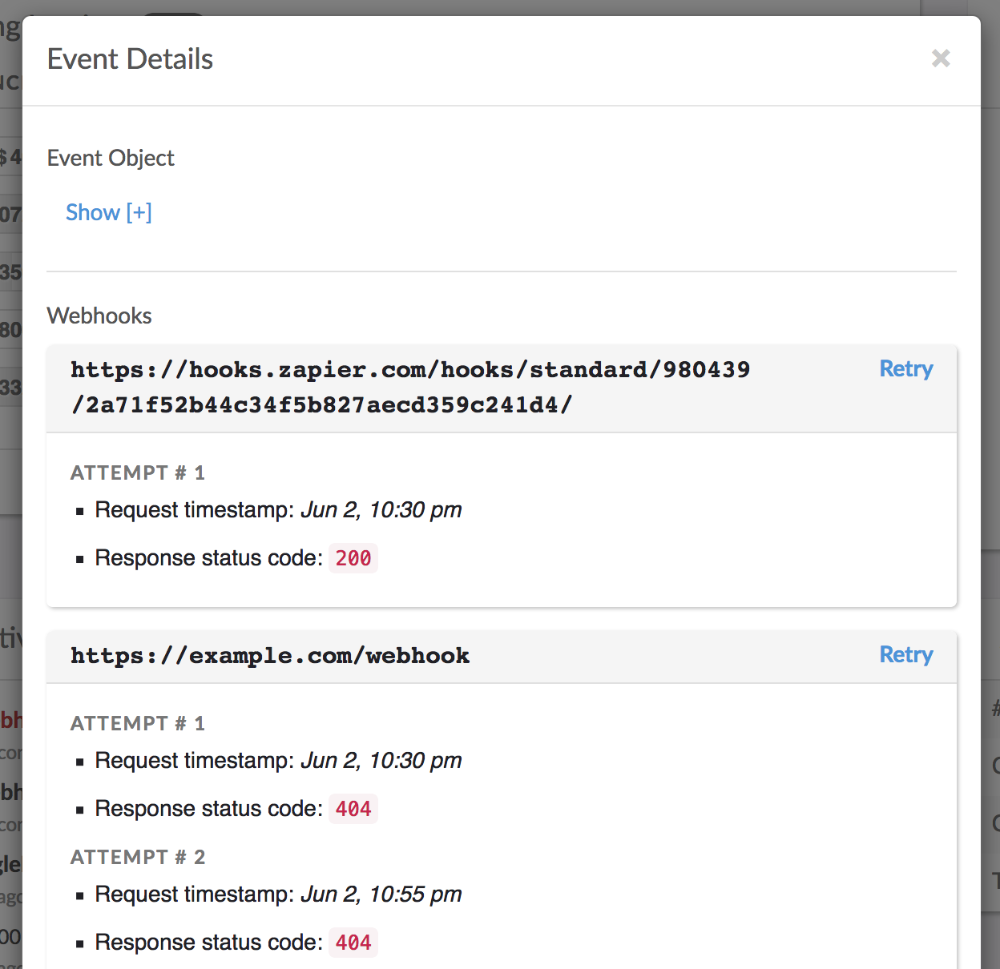

# Webhooks

Webhooks are HTTP callbacks that notify your systems when important events happen within your Invoiced account.

Invoiced creates events whenever something notable happens on your account, such as an invoice being created or a payment being received. Webhooks allow your integration to be notified asynchronously when an event occurs. The notification is an HTTP POST call that we make to the webhook URL(s) that you set up. You can find a full list of [supported events](/docs/api#event-types) in the API reference.

Example uses of webhooks:

- Updating your membership system when a customer's subscription becomes past due
- Triggering a shipment once an invoice is paid
- Reconciling an invoice in the books after receiving a payment
- Billing for metered usage from the previous period when a subscription renews

## Using webhooks

### Setting up webhooks

It's simple to get started with webhooks. In the dashboard you can go to **Settings** > **Developers** > **Webhooks** to add your endpoint. All you need is a URL (i.e. `https://example.com/invoiced/webhook`) that you want to receive webhooks at.

<strong>Testing webhooks?</strong> If you are just testing webhooks and do not want to set up an endpoint within your service yet, then you could use a tool like [ngrok](https://ngrok.com/) to quickly generate a test endpoint that lets you inspect the webhook messages we send.

### Receiving a webhook

Once your webhook endpoint has been set up then any supported events that occur will trigger an HTTP POST call to your endpoint. The request body will be a JSON-encoded string of the event. The event object will also contain the original object that triggered the event, such as an invoice or a transaction. You can see the Event object structure in the [API reference](/docs/api#event-object).

### Validating a webhook

Webhooks are delivered with an `X-Invoiced-Signature` header that contains an HMAC-SHA256 signature of the request body, using your webhook secret as the signing key. This allows you to verify that webhook events came from Invoiced.

The webhook secret can be obtained in **Settings** > **Developers** > **Webhooks**. On each incoming request you can then generate the HMAC digest of the request body using the webhook secret and compare that to the signature sent from Invoiced. While it is not required that you validate webhooks are properly signed we strongly recommended it.

#### IP Addresses

Below is a list of IP addresses that webhooks will come from. This can be useful if you need to whitelist the IP addresses that you will receive webhooks from in your firewall rules.

- `52.9.36.210`
- `13.56.137.61`
- `13.59.179.192`
- `3.19.95.157`
- `3.19.101.198`

### Responding to a webhook

We consider a webhook attempt successful when you return a `2xx` HTTP status code within *30 seconds*. Any other status codes will be considered a failure. A response body is not required, and if you do send one it will be ignored.

Instead of processing an event on the spot we recommend that you queue it for later processing and return a `2xx` status code immediately to prevent timeouts.

#### Webhook failures

If a webhook attempt fails then we will reattempt the webhook every 1 hour for up to 48 times (2 days). If the final delivery attempt fails then your webhook endpoint will be disabled.

#### Troubleshooting webhooks

Within the Invoiced application you can click on the **Details** button underneath any event. You will see all of the webhook attempts and a summary of each response we received.

#### Retrying webhooks

Sometimes you might find that a webhook was delivered correctly, but due to an error in your webhook handler it was not processed as desired. Or perhaps your webhook handler was disabled and you missed a few events. On the event details screen there is a **Retry** button next to each of the previous webhook attempts for that event.

### Best Practices

We try our best to deliver webhooks immediately after an event has been created, however, for various reasons there could be a delay between an event happening and when its corresponding webhook gets delivered. For this reason we recommend using API calls whenever you need an immediate answer instead of waiting for a webhook since the API endpoints are synchronous. Otherwise webhooks are perfect for handling asynchronous tasks.

It's possible that the same event could be sent more than once. It's strongly advised to make your webhook idempotent. This means that your webhook can safely receive the same event multiple times without affecting the outcome. An easy way to accomplish this is to track the IDs of events that you process in order to ignore duplicate calls.

If you want to catch up on any missed events or implement a backup mechanism in case a webhook is not delivered then you can use our [Events API](https://invoiced.com/docs/api/#list-all-events) to retrieve recent activity. The events you retrieve will be identical to the payloads sent in webhooks.