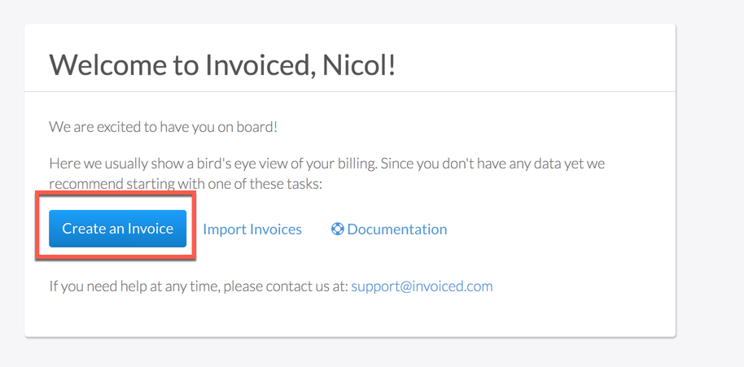
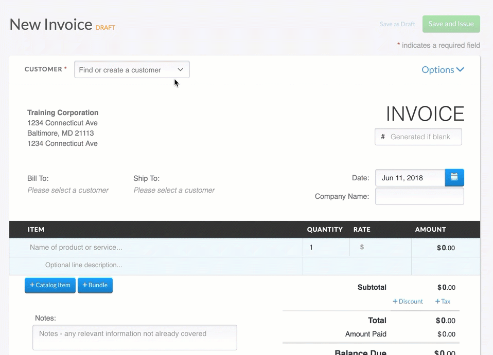
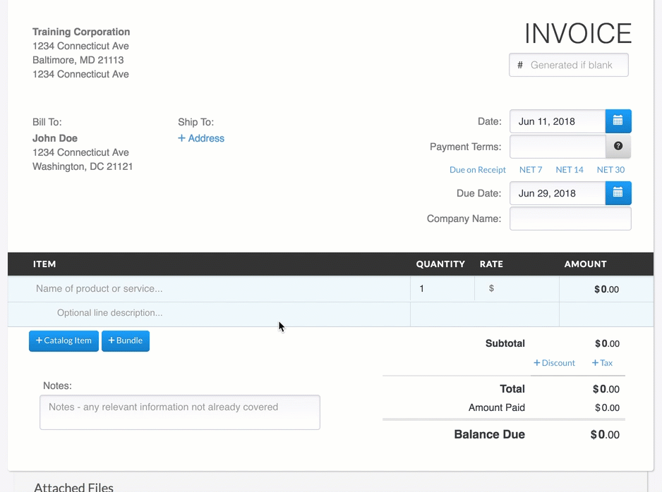
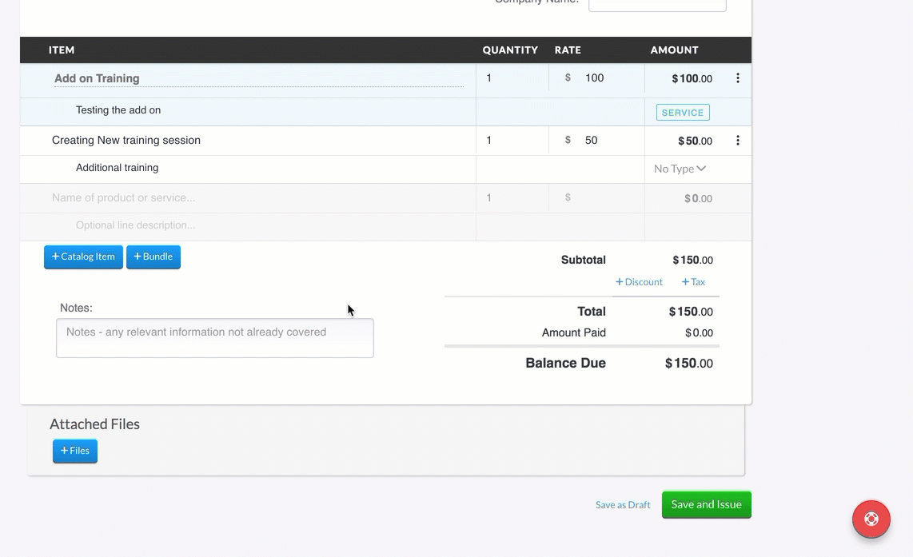
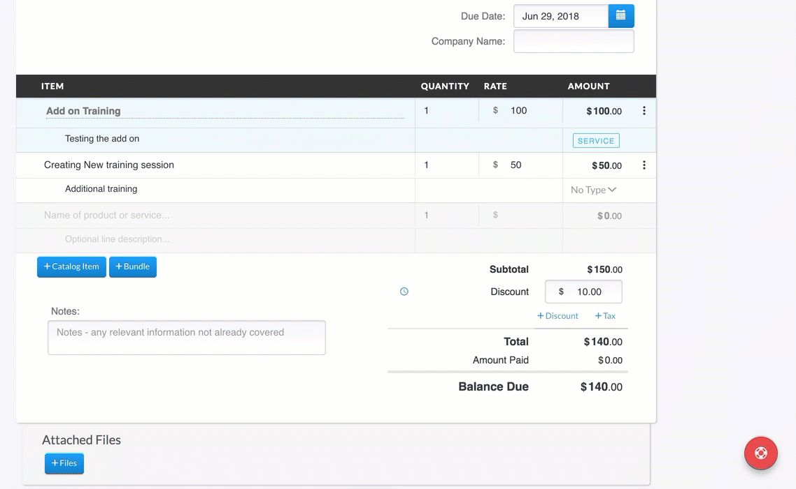
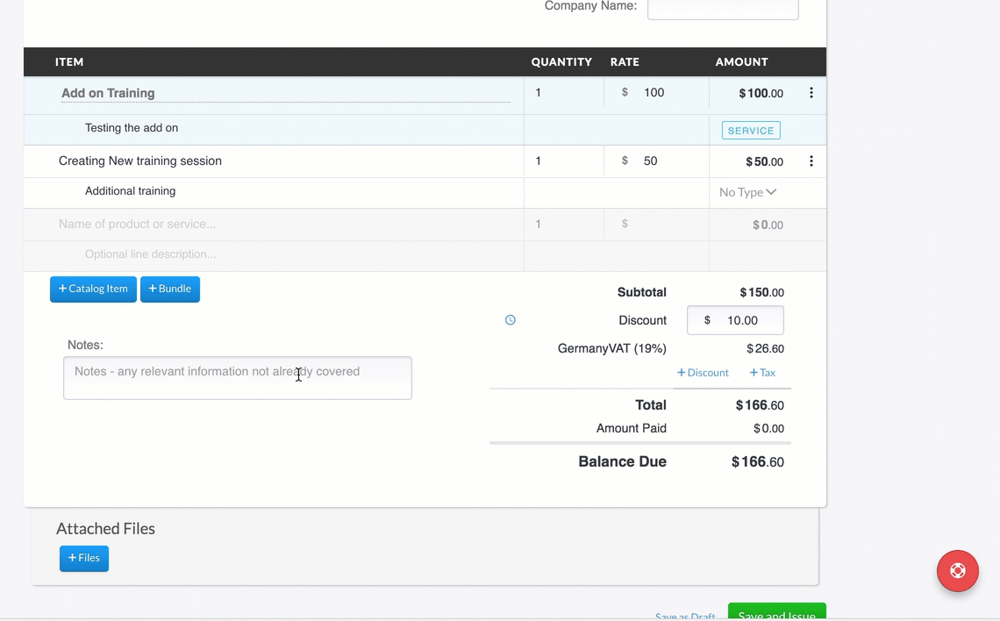
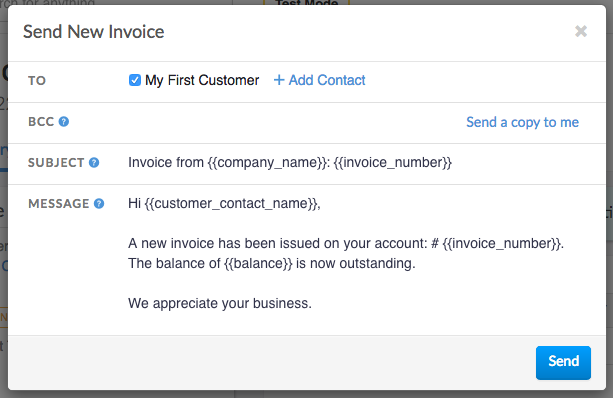
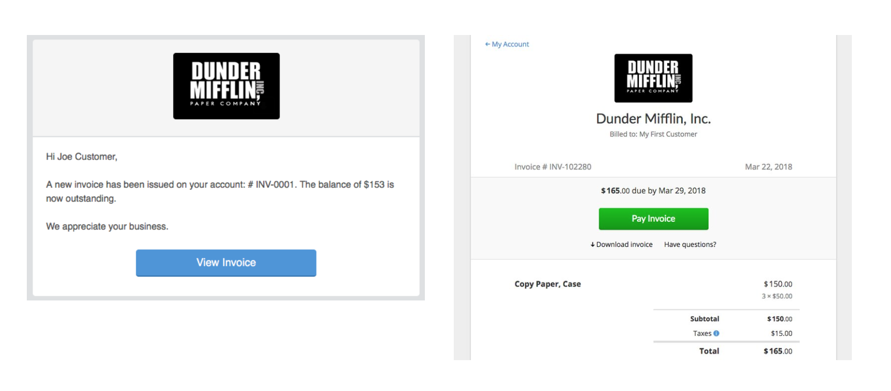
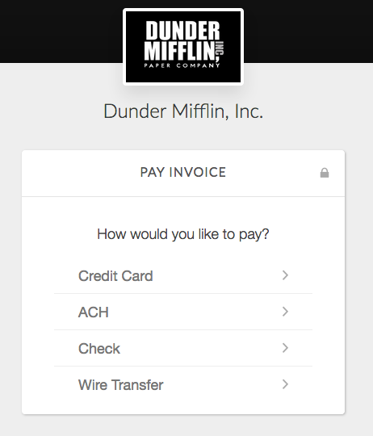
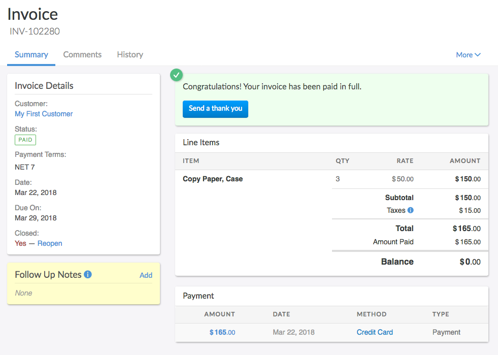

# Creating Your First Invoice

Creating an invoice is a fairly simple process. After all, it's the main thing that Invoiced was designed to do. If it is your first time logging into your Invoiced account, we are happy to announce you are one step closer to creating your first Invoice. Once you log into your account for the first time, your dashboard won't contain any details regarding your account overview until you have created your first invoice. Not to worry. Simply click on Create First Invoice to get started. 

You can also click on the *Invoices* section in the left sidebar to be taken to the invoices page. Then click the big *New Invoice* button at the top of the page to create a new invoice. 

Now you are inside of the invoice editor. The most important aspect of creating an invoice is to select the customer you wish to send the invoice to. Let's select the customer that we are invoicing. Click the dropdown where it says Find or create client and start typing your customer's name. If you have not created any customers, the customer will not exist yet, so you will need to click Add My First Customer as a new client. A new dialog will appear where you can enter your customer's information. You can refer to the Customers documentation to find the step by step setup of the customer contact information. 

Once the customer is created and/or selected, the invoice information can now be generated. This is where you are going to select the items the customer will be billed for. Let's break this part of the invoice creation into sections. 

## Selecting a Date

In the right corner of the invoice, you will find a section to select a date of the invoice. The date is when the invoice is created. If you are going to be sending this invoice out in the future, and creating a due date or net payment term, you will want to set the creation date as the date in the future you wish to send it. Note: The invoice will not automatically be sent on the due date, this is just for calculating the payment term purposes. 

When selecting or creating the customer the invoice will go to, it will prompt you to select a payment term or if the customer will be on autopay. The payment term for the customer or the autopay information will show under the Date field. If you wish to change this to a specific date to bill the customer, delete the payment term in the payment term selection and a due date box will appear. Here is where you can select a due date. 

## Applying Items to the Invoice

Items refer to what you are invoicing the customer for. This can include services, products, time, shipping, etc. Items can be created on the fly, within the invoice, or, they can be created and stored in the Catalog. Catalog items are stored in your Settings → Catalog section. Please refer to the Catalog tutorial for more information. Items can also have descriptions that will describe the reason or the product information they are being charged for. This is not a mandatory field.

Once you have selected or created the items the customer will be billed for, you can now select the quantity they will be billed for as well as rate of the item. ** Note: If a catalog item is created and generated, the rate will be generated also. You will just need to specify the quantity.** 

## Applying a Discount and Tax

You are now 75% of the way completed with creating an invoice! If you wish to apply tax or a discount to the invoice, here is where you will do so. 

*Discounts* 
Discounts can be created before creating the invoice in your Settings → Coupons section. Please refer to the Discounts tutorial on how to create these. If you have not yet set up the discounts to be used, you can apply a manual discount on the invoice. To apply a discount manually to the invoice, simply click on the +Discount field. This section will present you with a box to apply a custom discount, select from existing discounts, or create a new discount code. Once you have selected and applied the discount, it will generate the discount on the invoice for you to review. 

*Taxes*
Taxes can be created before creating an invoice in your Settings → Taxes section. Please refer to the Taxes tutorial on how to create and apply Tax Rates and Tax Rules to invoices. If you have not set up a tax rate or rule, you can apply a manual tax percent to the invoice. To apply taxes manually to an invoice, simply click the +Taxes field. This section will present you with a box to apply a custom tax rate, select from existing created taxes, or create a new Tax rate to be added to your Tax rate catalog. Once you have selected and applied the tax rate, it will generate the tax information for you to review.

## Applying Notes to an Invoice

Being able to add a note to a customers invoice can always be important. Especially if you are looking to add a personal touch to their invoice. The Notes section allows you to enter anything relevant to the customer or invoice you are sending. It will show on the invoice PDF for the customer to review. 

*Applying Attachments to an Invoice*

Invoiced found that users needed the ability to add external documentation to sending invoices. The attachment section of the invoice creation allows companies to do just that, attach external documents. This will also be added to the invoice when sent to the customer. 

After building your line items, selecting your discount and tax information, and applying notes  you are ready to go. If you are not ready to go live with this invoice then you can save it as a draft. An invoice is not treated as outstanding until it has been issued. By clicking *Save and Issue* the invoice will be posted to the customer's account and is now considered due.

## Sending the invoice 

Upon issuing the invoice we will ask if you want to send it. If you choose not to send it now you will have the option to send it later or else mark the invoice as sent if you sent the invoice using some other medium. To send the invoice now, simply click Send Invoice. This function will present the user with a pop-up to review the email that will be sent to the customer. The information generated is created in the email template section of your Invoiced account. This can be found in Settings → Emails. After reviewing the email information, you can now send the invoice. Once the invoice is sent, the customer will receive an email with your branding, information, and invoice information. 

*Automatically sending invoices*

Invoiced has a great feature if you wish to have the email sent at the time the invoice is created. You can set up a Chasing rule to send on issuing, which will send the invoice automatically, and no manual production of the invoice will need to be done. 

You can learn more about the [chasing process here](https://invoiced.com/docs/payments/chasing).

## Getting paid 

When your customer clicks the *View Invoice* button in the invoice email, they will be taken to the invoice in the customer portal. The customer portal is where customer's can view and pay invoices, in addition to having access to their past billing history. Another nifty feature is that once your customer views an invoice we will send you a notification to let you know they have seen it. Note: Notifications can be turned on and off in your Settings → Notifications section. 

Here, the customer can leave a comment (Have Questions?) , download the invoice, or pay the invoice. In order for the customer to pay, they can click the *Pay* button at the bottom located at the top of the Invoice details. They will be taken to the payment page to select a payment method. 

Payment methods available for the customer to use are generated by what is available and set in your Settings→ Payment section. You can also specify, by customer, what a customer can use in order to pay an invoice. This can be specified under the customers account profile information in Invoiced. 

To learn more about Payments, please refer to the Payment documentation. 

Once your customer pays online, the payment will be recorded automatically in the dashboard and they will be issued a receipt. 

What's next? 

This tutorial has shown you what a simple invoicing workflow looks like with Invoiced. We recommend checking out our other guides to learn how to solve more complex billing workflows and set up automation for tedious billing tasks. There are guides for [subscription billing](https://invoiced.com/docs/guides/subscription-billing), [chasing](https://invoiced.com/docs/guides/chasing), [payments](https://invoiced.com/docs/payments), and more.

