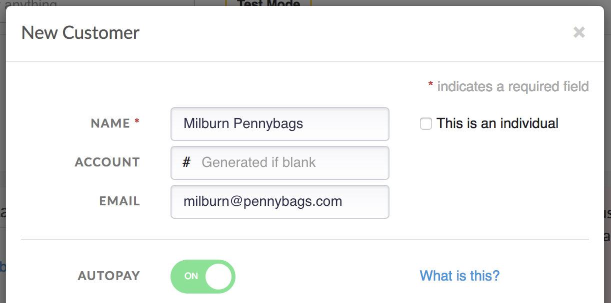
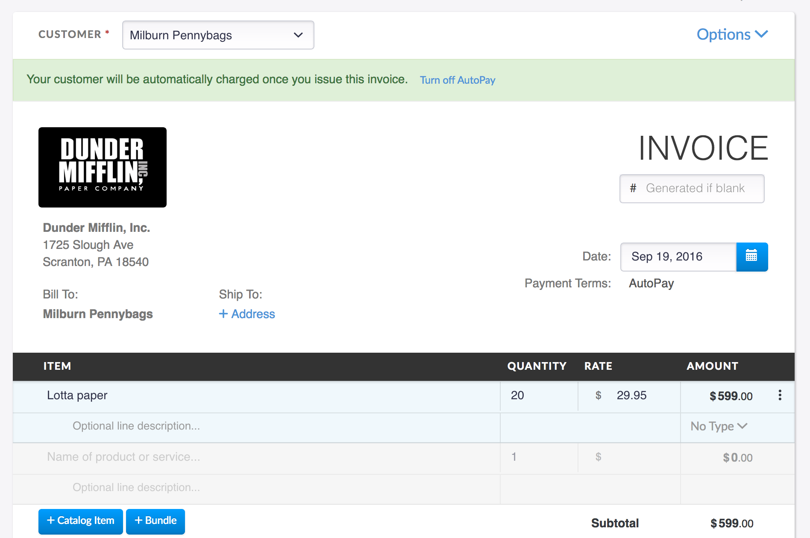
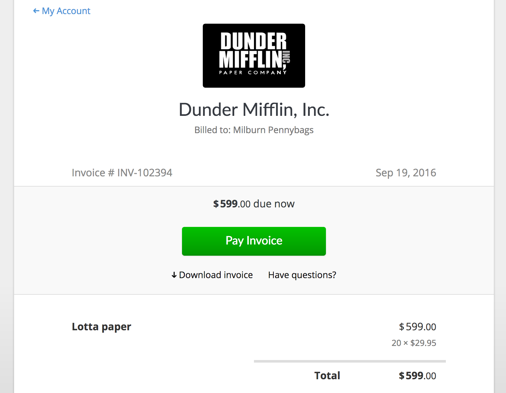
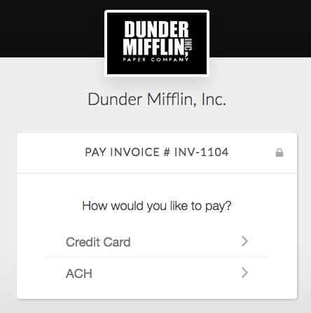
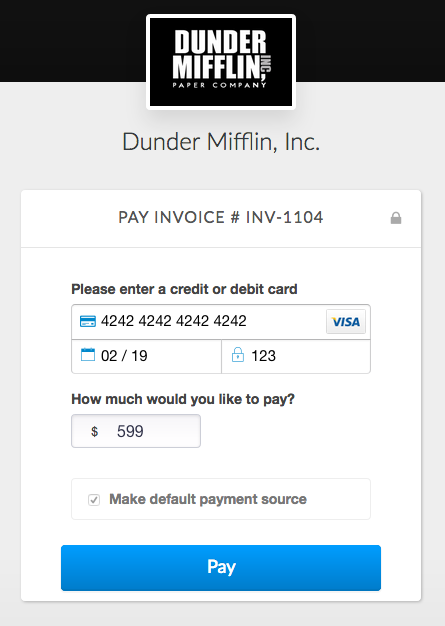
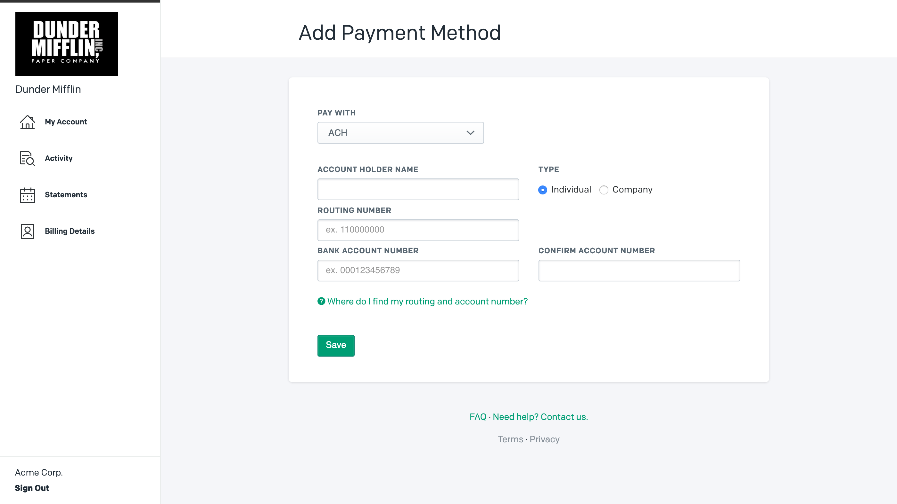

# AutoPay

With AutoPay you can automatically collect payment from customers when an invoice is issued. AutoPay draws payment from your customer's attached payment source.

## How it works

AutoPay allows you to securely collect and charge payment sources for customers. In order to use AutoPay you must follow these simple requirements:

1. Subscribe to an Invoiced [plan that supports AutoPay](https://invoiced.com/pricing). There are no limits to the number of AutoPay customers or invoices you can create.

2. Have at least one payment method enabled that supports AutoPay. Currently AutoPay works with **credit card** and **ACH** payments.

3. A payment source connected to each AutoPay customer. When connecting bank accounts the customer must verify the account before it can be charged.

### Connecting payment sources

There are multiple ways to connect a payment source to a customer's account.

1. [Sign Up Pages](sign-up-pages)

   New customers that sign up for a subscription through sign up pages will have AutoPay enabled and a connected payment source.

2. [Billing Portal](billing-portal)

   Existing customers can sign into your billing portal and click **Add Payment Source**.

3. Sending an AutoPay invoice to your customer

   This approach involves sending an AutoPay invoice to a customer that does not have a connected payment source. Your customer will be able to pay the invoice online like normal, but we will also save the payment source used to pay for future AutoPay invoices.

4. Adding a credit card through the dashboard
   
   This is useful if you have a customer in person or are accepting orders over the phone. Since bank accounts must be verified first we do not support adding bank accounts through the dashboard.

### Failed Payments

AutoPay was designed to gracefully handle failed payments. We will automatically retry failed payments according to your retry schedule. If the payment succeeds at any point then the retry schedule will stop. Your customer will also be sent a [Failed AutoPay Attempt](emails#payments) email. The email will include an **Update Payment Source** button in case the customer's payment information is out of date.

Failed payments will be retried according to the following schedule:

- 3 days after first payment attempt
- 5 days after second payment attempt
- 7 days after third payment attempt

After all of the retries have been exhausted then the invoice will be marked as past due. Additionally if this was for a subscription invoice you can control what happens to the subscription in **Settings** > **General** > **After Subscription Nonpayment**.

## Usage

### Setting up AutoPay

Let's walk through a basic scenario where we set up AutoPay for a customer by sending them an invoice.

1. Enable a payment method that supports AutoPay

   Go to **Settings** > **Payments** to enable **Credit Card** or **ACH** payments.

   

2. Turn on AutoPay for your customer

   Now we are going to create a new customer account. If you are creating a new customer then turn on the **AutoPay** switch.

   

   We are going to leave **Add Later** selected for the payment source because we are going to collect their payment information by sending an invoice. We are going to add the customer's payment source by sending an invoice.

   *If you want to convert an existing customer to AutoPay then you can open the customer's account and click **Edit** in the *Profile* section.*

3. Issue an invoice

   Let's create and issue an invoice against the customer's account.
   
   

   Next send the invoice to your customer.

   

4. Customer pays to connect a payment source

   The customer will be able to view the invoice like usual. They will then click **Pay**.

   

   When they click **Pay** the customer will be able to select one of the payment methods you have enabled that supports AutoPay.

   

   Then while paying the invoice we will securely collect your customer's payment source for use on future AutoPay invoices.

   

### Updating payment sources

Once a customer's added a payment source they can update it at any time through the billing portal by clicking **Change** in the *Payment Source* section.

Invoices will also have an **Update Payment Source** button. Certain payment gateways like Stripe will [automatically update customer payment information](https://stripe.com/blog/smarter-saved-cards) if they are issued a new credit card.

## FAQ

### When is payment for AutoPay invoices collected?

Payment will be collected no earlier than 1 hour after the invoice is issued. Generally you can payment to be collected in 1-2 hours. The 1 hour minimum delay gives you time to recover from any potential mistakes.

However, if the invoice date is in the future then payment will not be collected until that date.

### Can I trigger payment for AutoPay invoices sooner?

Absolutely. If you open the invoice in the dashboard you can trigger payment sooner by clicking **Pay now** on the invoice. This will initiate a collection attempt immediately.