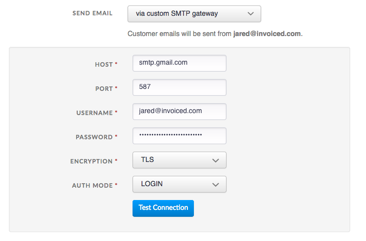
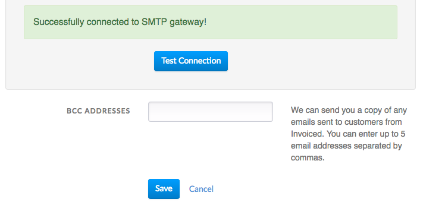

# Emails

Email is a core component to any online billing system. Here you can learn more about how sending works on Invoiced.

## Features

We have built many features around sending and email to make billing less stressful.

### Auditing

We log and track every message sent to customers from Invoiced. When it comes to billing, it's super important to be able to look up past communications with your customer. Within the dashboard you can see precisely what messages were sent to customers, when, and by whom. We track opens, clicks, and views (for invoices).

### View Tracking

Anyone that has billed customers before has probably heard the "I never received it" excuse, at least once. Sometimes it is true that the client never received the invoice. We built view tracking to to solve this problem.

All invoices have what is known as the **Client View**. The client view renders the full document in the recipient's web browser and supports several features, like online payments, PDF downloads, commenting, file attachments, and more. The client view is hosted on your [billing portal](billing-portal).

Sending invoices have a **View Invoice** button that links to the client view. As soon as your client clicks the view button we log it and notify you.

*Note: we have taken precautions to prevent false alerts should you open the client view of your own invoice.*

### Email Whitelabeling

Invoiced allows you to completely whitelabel your billing emails when you elect to have emails sent through your own email infrastructure. All you need to send customer emails from your own servers are SMTP credentials. Keep reading to learn how to set up email whitelabeling.

### Gmail Actions

We also have a partnership with Gmail that will give special treatment to the invoices you send to Gmail users. Your clients will see a **View Invoice** next to the subject line that takes them straight to the client view without ever needing to open the email. We've seen an uptick in views and paid invoices with this integration.

## Customizing Email Templates

Our default email templates were written to be professional and clearly communicate important billing information to your client, however, we understand these defaults do not work for everyone. It's easy to change the default email templates we use for emails.

The email templates use Mustache for templating awesomeness. Please consult the [Mustache documentation](https://mustache.github.io/mustache.5.html) to learn more. You can use [this tool](http://trymustache.com/) to validate your email templates. The funny-looking values like **{{customer_name}}** are placeholders that get replaced with the correct value, like the client's name, at send time.

In order to customize any of the email templates you need to go to **Settings** > **Emails** in the dashboard. Just click the **Customize** button next to the email template you want to edit the message and other settings. When finished you can click **Save**.

## Available Email Templates

### Invoices

**New Invoice** - Used when an outstanding invoice is sent to a customer for the first time, or when a manually collected invoice is generated from a subscription. Includes a **View Invoice** button.

**Invoice Reminder** - Used for outstanding invoices that have already been sent but are not past due yet. Includes a **View Invoice** button.

**Late Payment Reminder** - Used for past due invoices. Includes a **View Invoice** button.

**Thank You** - Used for invoices that have been paid in full. Includes a PDF attachment of the invoice.

### Payments

**Payment Receipt** - Used for payment receipts. Includes a PDF attachment with the receipt.

**Failed AutoPay Attempt** - Sent when a payment attempt on an AutoPay invoice fails. Includes an **Update Payment Info** button.

### Subscriptions

**Sign Up Confirmation** - Sent to confirm a customer has been signed up to a subscription. Includes a **Manage Subscription** button. *Turned off by default.*

**Renews Soon** - Sent to notify a customer their subscription renews soon. You specify how many days in advance of a subscription renewal to send these notices. Includes a **Manage Subscription** button. *Turned off by default.*

**Cancellation** - Sent to confirm a customer's subscription has been canceled. *Turned off by default.*

### Customers

**Statement** - Used to send customer statements. Includes a PDF attachment of the statement.

## Email Delivery

Out of the box Invoiced will send emails to your customers using our carefully tuned email infrastructure. Emails will appear as if they came directly from your business. Customers should not see the Invoiced brand anywhere, and any replies will go to your email address. Any emails sent through our servers will be from **no-reply@invoiced.com**.

Sending via Invoiced's email servers works just fine for most businesses, and it requires zero set up. However, some businesses might run into deliverability issues when sending to customers with strict spam filters. Generally this is an issue when sending to large corporations. If you run into deliverability issues then you can ask your customer to whitelist **no-reply@invoiced.com**, although this is less than ideal.

An even better solution would be to let us send emails through your own email account or server. By providing us with [SMTP](https://en.wikipedia.org/wiki/Simple_Mail_Transfer_Protocol) credentials we can send through any server you specify. Invoiced will then send any customer emails through that SMTP interface using your email address as the sender instead of no-reply@invoiced.com. This will improve email delivery for your customers, and as a side benefit, make it possible for you to directly monitor all of the emails sent to customers through Invoiced.

### Setting up custom SMTP

1. Go to **Settings** > **Email** in the Invoiced dashboard. Click **Change** next to the email settings.

2. Select the send email **via custom SMTP gateway** option.

   

3. Enter in your SMTP credentials and click **Test Connection** to verify they are correct.

   

4. Click **Save** to save these changes.

Emails will now be sent through the SMTP gateway you entered. You can test this out by sending an invoice to yourself and checking if the sender address matches your company address.

Since emails will be sent with your business email address as the sender please make sure that your SMTP gateway is properly configured for this. Your SMTP gateway must also support TLS or SSL encryption in order to be used with Invoiced.

If we are unable to connect to the gateway for any reason when sending email then we will failover to our email servers.

#### G Suite / Gmail Users

You can send through a Google email account using [SMTP](https://support.google.com/a/answer/176600?hl=en), however, there are a few extra considerations needed:

1. You must first enable sign in for less secure apps [here](https://www.google.com/settings/security/lesssecureapps). You can learn more about this in [Google's docs](https://support.google.com/accounts/answer/6010255).

2. Your username will be your full email address, i.e. **bob@gmail.com**, and the password will be the same as the one used to sign in. If you have 2-step verification enabled then you can [generate an app-specific password](https://support.google.com/mail/answer/185833?hl=en) for Invoiced instead of using your primary password.

3. When entering in the SMTP credentials, before you click **Test Connection**, you might need to visit [this page](https://accounts.google.com/DisplayUnlockCaptcha). If you still run into issues then this [Google article](https://support.google.com/accounts/answer/6009563) might help.

4. Please be aware of the [sending limits](https://support.google.com/a/answer/166852) when sending through Google.

You can verify the SMTP gateway is working by checking your **Sent Mail** folder. You should see emails sent through Invoiced in there.

## Invoice PDF attachments

The default behavior for Invoiced is to include a **View Invoice** button that links to the client view in the billing portal. Only the **Thank You** email will include a PDF attachment of the document. When your customer clicks the View Invoice they will be taken to an interactive document online that supports view tracking, file attachments, commenting, payments, and also has a download button for the document.

While we *strongly recommend* using the client view because of its many advantages, we understand there are situations where you may want to send a PDF instead, such as when you are sending invoices into automated systems. You can elect to send PDFs instead of a client view link. Here's how you do it:

1. Click **Customize** on the email template you want to have a PDF attachments in **Settings** > **Emails**.

2. Turn on the **Attach PDF instead of client view button** option.

3. (optional) If you want to send a view button *and* a PDF attachment then you need to also add a `{{{view_invoice_button}}}` line to the message body.