# Estimates

Estimates on Invoiced help you present quotes to customers, capture approval, and collect up-front deposits (prepayments).

There are numerous use cases where estimates on Invoiced can help:
- Tracking quotes
- Representing sales orders
- Prepayments / Deposits / Retainers
- Collecting approval from your customer to move forward with an order
- Calculating price estimates for a job or project

## Estimates vs. Invoices

On the surface estimates and invoices look very similar. Both types of documents have line items, a total, and a bill to line (among other things). However, they each serve a unique purpose. The key difference between estimates and invoices is that estimates are not considered an amount owed by your customer, whereas an invoice is a formal statement of a balance due.

Estimates generally are used at the start of a transaction. Typically an estimate will be presented before a sale has finished, or before any money is due. Invoices on the other hand are issued at the end of a transaction when money is owed by your customer.

## Enabling Estimates

The estimates addon is disabled by default. Follow these steps to enable estimates:

1. Go to **Settings** > **General** in the Invoiced dashboard. Towards the bottom of the page you will find an *Estimates Addon* toggle.

   

2. Click on the toggle next to *Estimates Addon*.

   [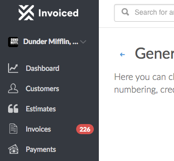](../img/estimates-enabled.png)

Your dashboard should grow a new *Estimates* tab. You are now ready to start creating estimates.

## Creating and Sending Estimates

Creating and sending estimates are nearly identical to the invoicing workflow. Follow these steps to issue estimates:

1. Click on the **Estimates** tab in the dashboard. Then click **New Estimate**.

   [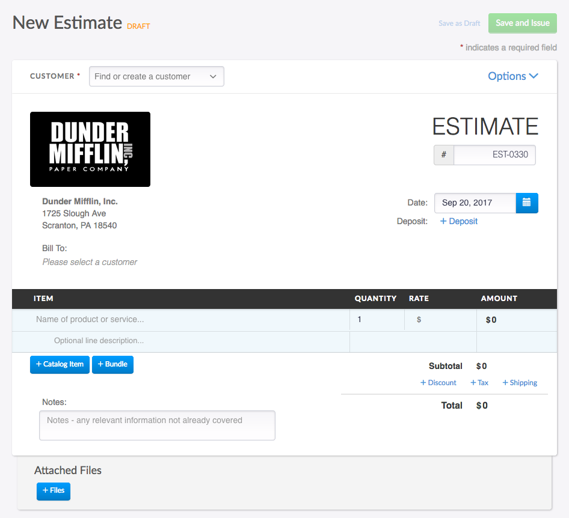](../img/new-estimate-1.png)

2. Select or create a customer from the dropdown at the top of the screen.

   [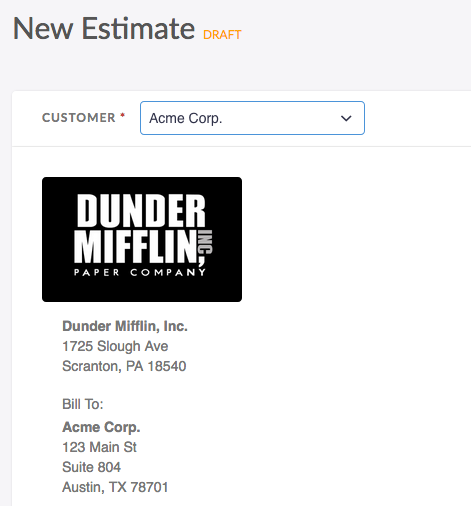](../img/new-estimate-2.png)

3. Fill in the line items and any other details for your estimate.

   

4. Click **Save and Issue**.

   

5. You will be asked if you want to send the estimate. Click **Yes**.

   [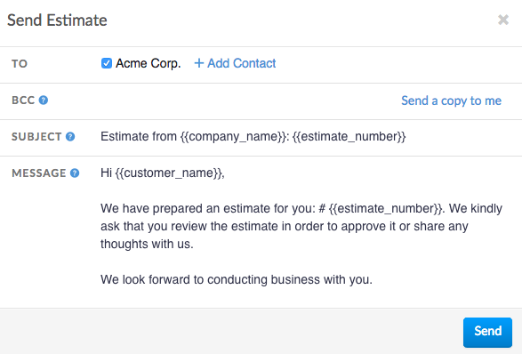](../img/send-estimate-2.png)

6. Click **Send** in order to send off the estimate to your customer.

   [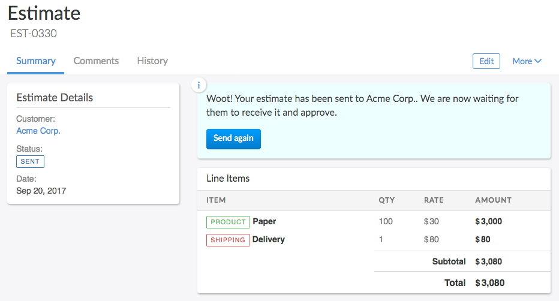](../img/issued-estimate.png)

### Client Workflow - Approving Estimates

When your client receives the email from Invoiced they should see a **View Estimate** button in that email.

[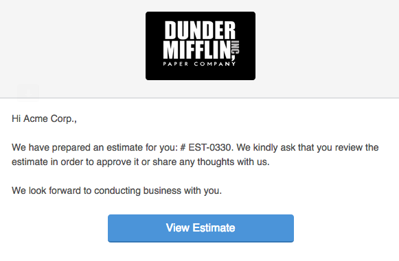](../img/estimate-email.png)

Clicking on the view button will take them to the client view where they can see all of the estimate information.

[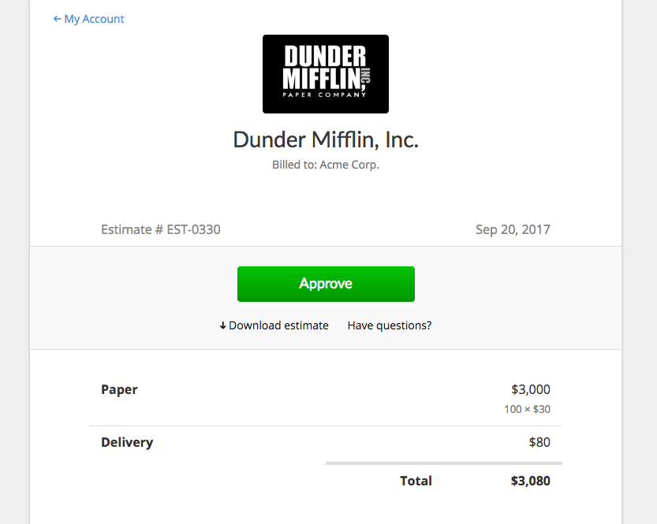](../img/estimate-client-view.png)

If everything looks right, your client will then click on the **Approve** button.

[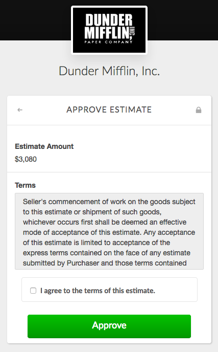](../img/estimate-approval-form.png)

Your client will be taken to another page where they can agree to your terms, if present, and approve the estimate. Before your client can approve the estimate they will be required to enter in their initials. These initials along with the IP address / timestamp will be recorded on Invoiced.

[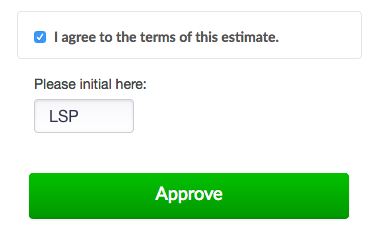](../img/approving-estimate.png)

The estimate is now approved. You should receive a notification about this. Once the project or order is complete you can then proceed with invoicing the client (see below).

[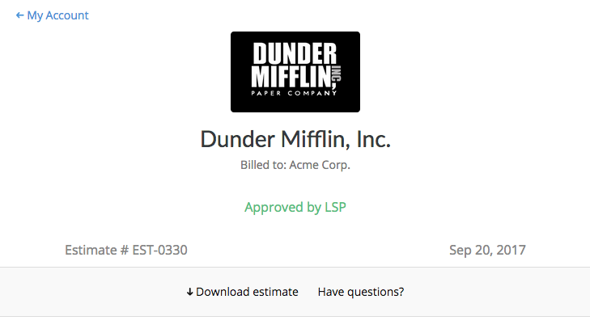](../img/approved-estimate.png)

## Estimate Deposits

Deposits allow you to collect an up-front payment when your customer is approving the estimate. The payment received will be added to the customer's credit balance. Then when the customer is invoiced, perhaps when the project is complete, this credit amount will be deducted from the invoice balance.

It's important to remember here that an estimate represents a balance before the sale is complete and before any money is owed.

### Adding Deposits to Estimates

Asking for a deposit payment on an estimate is fairly easy. It is just one extra step when creating your estimate.

1. Open up the new estimate screen and follow the instructions above. Fill in your estimate as you would normally.

   [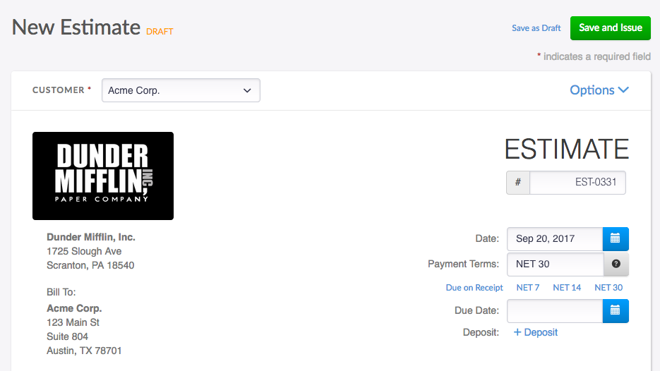](../img/estimate-deposit-1.png)

2. Click on the **+ Deposit** button in the top-right.

   [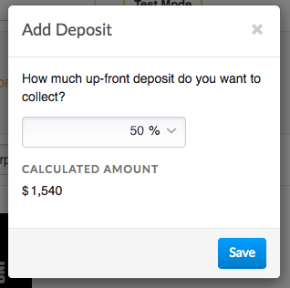](../img/estimate-deposit-2.png)

3. You will be asked to enter in the amount of the deposit. You can enter in a fixed amount or percentage.

   [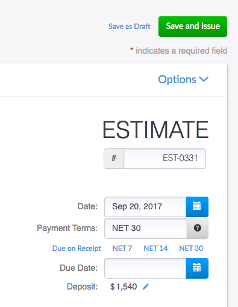](../img/estimate-deposit-3.png)
   
4. You can now save the estimate and send it to your customer.

### Client Workflow - Paying Estimate Deposits

When your customer views the estimate they will see a *$X deposit payment required* at the top of the screen. They would then click the **Approve** button.

[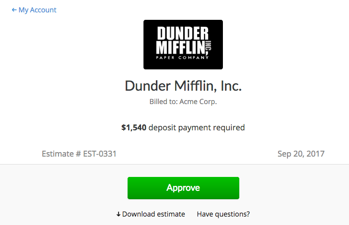](../img/estimate-client-view-deposit.png)

On the approval page your customer will enter in their payment information, agree to your terms, and initial for approval.

[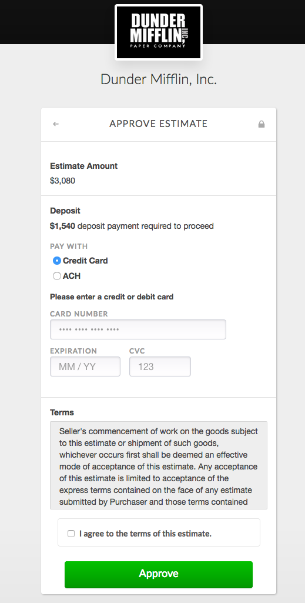](../img/estimate-approval-form-deposit.png)

When the customer clicks **Approve**, Invoiced will process the payment and credit the customer's account.

## Converting Estimates to Invoices

Whenever you are finished with the job or project on an estimate, you can quickly generate an invoice from that estimate. These steps outline the process.

1. Open the estimate in the dashboard.

   [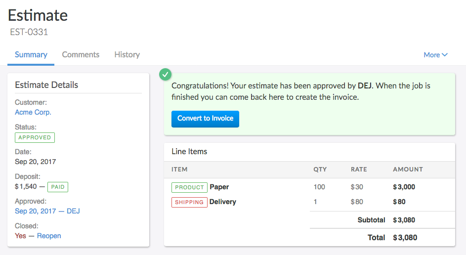](../img/approved-estimate-invoicing.png)

2. Click **Convert to Invoice**. You will be taken to the invoice screen. The details from the estimate should be filled into the invoice. If you want to change any details on the invoice, for example if there were extra costs that need to be added to the bill, then simply click the **Edit** button in the top-right to modify the invoice.

   [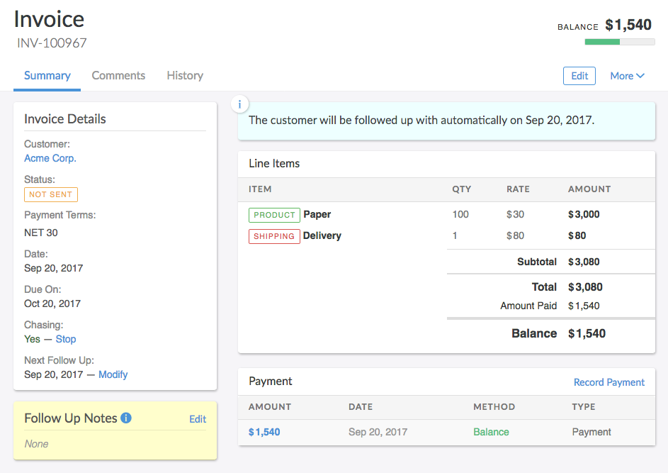](../img/invoice-from-estimate.png)