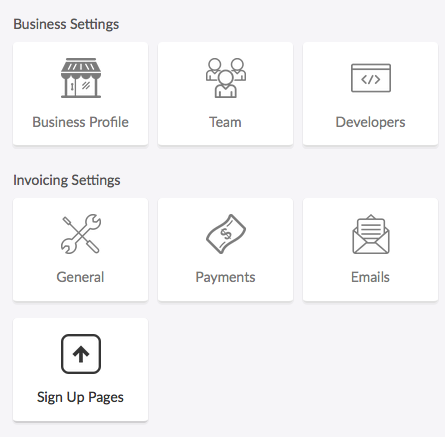
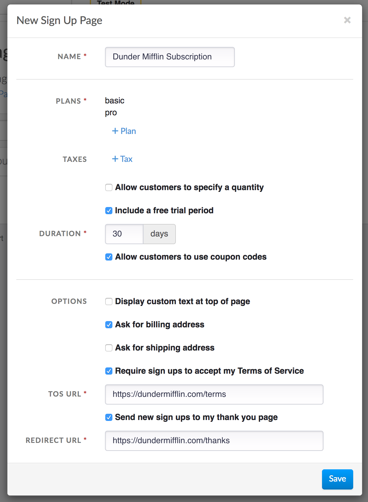
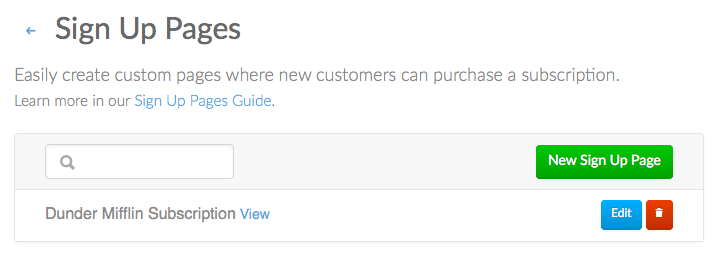
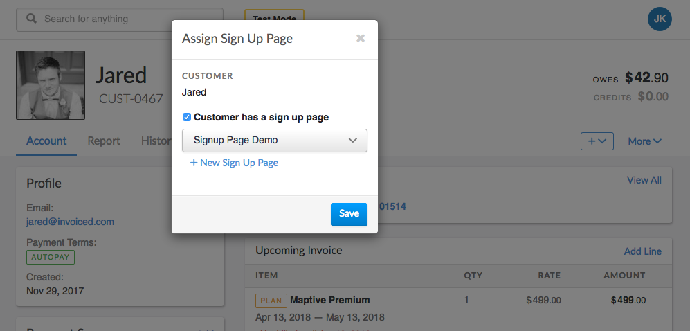

# Sign Up Pages

Easily build hosted pages for onboarding new customers into subscription billing. Building a sign up page is super quick and requires no coding.

A sign up page will create a new customer on Invoiced, securely collect payment information, and subscribe the customer to the plan they select. All sign up pages will do the following when submitted:

1. Create a new customer profile
2. Subscribe the customer to a plan they select
3. Save the given credit card or bank account as the customer's payment method
4. Enroll the customer in [AutoPay](autopay)

Sign up pages also have these optional capabilities:

- Collecting billing and/or shipping addresses
- Coupon codes
- Free trial periods
- [Calendar billing](subscription-billing#calendar-billing)
- [Custom thank you pages](#custom-thank-you-pages)
- Customizable header text
- Terms of Service agreement

## Usage

Prerequisites:

1. You must have [credit card](/docs/payments/card), [ACH](/docs/payments/ach) and/or [direct debit](/docs/payments/direct-debit) payments enabled.

### Building a sign up page

1. Go to **Settings** > **Sign Up Pages**.

   

2. Click **New Sign Up Page**.

   

3. Give your page a name and select all of the plans that should be available to customers signing up from this page. There are other options available, like asking for a billing or shipping address.

   

 Note: You can now enable AutoPay only directly on the sign up page. Simply select the AutoPay only option on the creation of the sign up page. 

    

Invoiced also provides other useful options when setting up sign up pages for your customers:

*Allow Customers to specify a quantity - *This setting allows you to control if the customer can use the sign up page and subscribe to more than one 

*Include a Free Trial - *This setting allows you to apply a free trial period to the beginning of the subscription. Simply enter the number of days you wish to add to the trial period. 

*Renew Subscriptions on Specific Day of the Month- *This allows you to select a specific day of the month for the subscription to be billed on. 

*Allow Customers to Use Coupon Codes- *This setting allows the customer to enter a coupon code at the time of sign up.

*Additional Options:*

*Display custom text at top of page*- Do you have specific instructions you need to detail on the sign up page? This section allows you to add text to the top of the page you would like your customers to see.

*Require sign ups to accept my Terms of Service - *You can now require customers to accept your terms of service by entering in a terms of service url. 

*Send new sign ups to my thank you page- *This setting allows you to send your customers to a custom thank you page after the customer completes the purchase. Simply enter in a url to the thank you page you would like the customer to be directed to. 

*Allow sign ups to purchase additional subscriptions - *This setting allows the customer to purchase other subscriptions you may offer. 

You can choose to add any of these options to customize the sign up process.

4. Click **Save**.

   

5. Now that your page is created it will be hosted at a unique URL within your customer portal. You can click the **View** button next to your new page to open the URL in a new tab.

   

### Selling addons on sign up pages
You can provide an add on option for the customer to choose from on the sign up page. An addon can be a one time charge or an additional subscription option. The subscription option must match the original subscription plan interval selected. 

   

You can allow the customer to specify a quantity of the add on and also note if it is a required option. 

### Signing up customers

All the customer needs to get started is to visit the URL of your sign up page. Sign up pages are hosted on a public but obscured URL within your customer portal.

There are many ways that you can direct customers to your sign up page. You can link to it from your website or app, send it to customers directly over email or text message, or seamlessly redirect customers as part of your existing checkout flow.

*Want to assign a sign up page to a specific customer? *
You can assign a customer a sign up page. This works well for scenarios like re-seller billing. Every time you would like to subscribe a new customer, you can go to a custom sign up page, or click the subscribe button in the customer portal. This allows the business to offer custom pricing to each re-seller as well. 

 To access this feature:

  **Customer** > **More** > **Assign Sign Up Page**

   

### Custom thank you pages

Sign up pages can redirect new customers to any web page after sign up instead of the default thank you page. What this means is that you can seamlessly send sign ups back to your own web site, to a form where a provisioning process can begin, or maybe a page where customers can download a digital good they've purchased.

#### Thank You Query Parameters

Upon sign up your customer will be redirected to your thank you page using a GET request. The URL that we redirect your customer to will also have the newly created subscription and customer IDs in the query parameters. These values will allow you to pull in and verify the details of a purchase using the [Invoiced API](../dev).

- `invoiced_subscription_id`
- `invoiced_customer_id`

As an example, if your thank you URL is `https://dundermifflin.com/thanks` then after sign up your customer will be redirected to:

`https://dundermifflin.com/thanks?invoiced_subscription_id=1234&invoiced_customer_id=6789`

