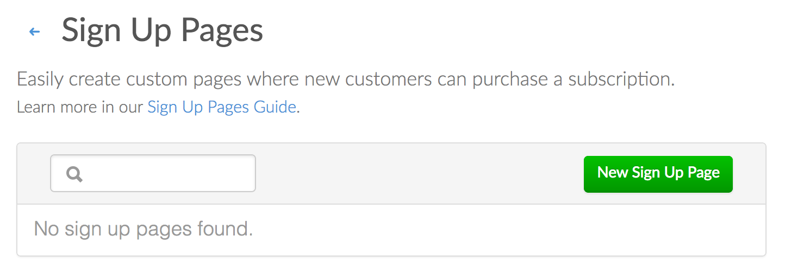

# Sign Up Pages

Easily build hosted pages for onboarding new customers into subscription billing. Building a sign up page is super quick and requires no coding.

A sign up page will create a new customer on Invoiced, securely collect payment information, and subscribe the customer to the plan they select. At a minimum sign up pages can:

- Create a new customer profile
- Subscribe the customer to a plan they select
- Securely vault a credit card or ACH payment source
- Enrolling the customer in [AutoPay](autopay)

Sign up pages also have these optional capabilities:

- Collecting billing and/or shipping addresses
- Coupon codes
- Free trial periods
- Custom thank you pages
- Customizable header text
- Terms of Service agreement

## Usage

Prerequisites:

1. You must have credit card and/or ACH payments enabled.
2. You must already have set up at least one recurring plan that you want to subscribe customers to in **Settings** > **Plans**.

### Building a sign up page

1. Go to **Settings** > **Sign Up Pages**.

   

2. Click **New Sign Up Page**.

   

3. Give your page a name and select all of the plans that should be available to customers signing up from this page. There are other options available, like asking for a billing or shipping address.

   

4. Click **Save**.

   

5. Now that your page is created it will be hosted at a unique URL within your billing portal. You can click the **View** button next to your new page to open the URL in a new tab.

   

### Signing up customers

All the customer needs to get started is to visit the URL of your sign up page. Sign up pages are hosted on a public but obscured URL within your billing portal.

There are many ways that you can direct customers to your sign up page. You can link to it from your website or app, send it to customers directly over email or text message, or seamlessly redirect customers as part of your existing checkout flow.

### Custom thank you pages

Sign up pages can redirect new customers to any web page after sign up instead of the default thank you page. What this means is that you can seamlessly send sign ups back to your own web site, to a form where a provisioning process can begin, or maybe a page where customers can download a digital good they've purchased.

#### Thank You Query Parameters

Upon sign up your customer will be redirected to your thank you page using a GET request. The URL that we redirect your customer to will also have the newly created subscription and customer IDs in the query parameters. These values will allow you to pull in and verify the details of a purchase using the [Invoiced API](../dev).

- `invoiced_subscription_id`
- `invoiced_customer_id`

As an example, if your thank you URL is `https://dundermifflin.com/thanks` then after sign up your customer will be redirected to:

`https://dundermifflin.com/thanks?invoiced_subscription_id=1234&invoiced_customer_id=6789`