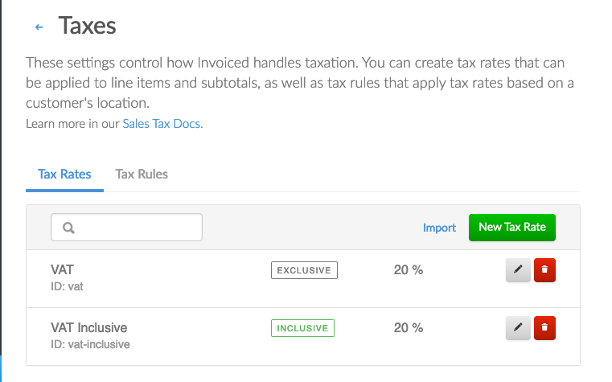
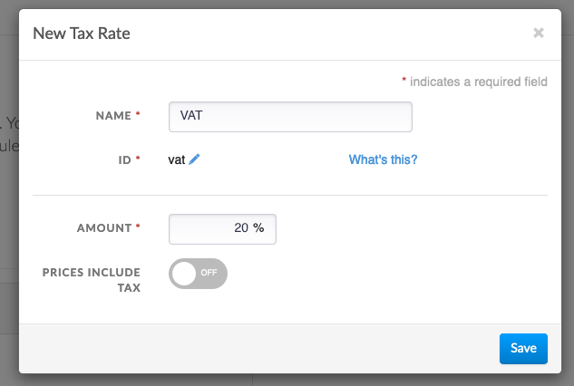
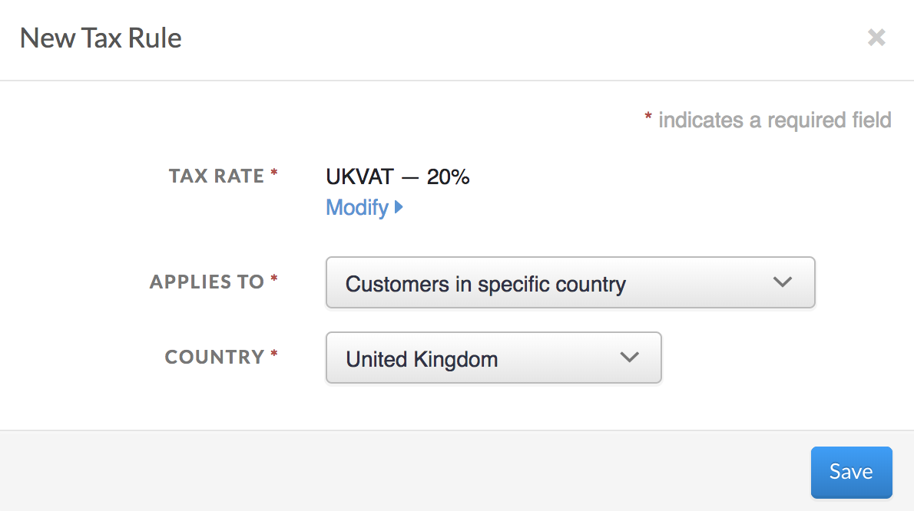
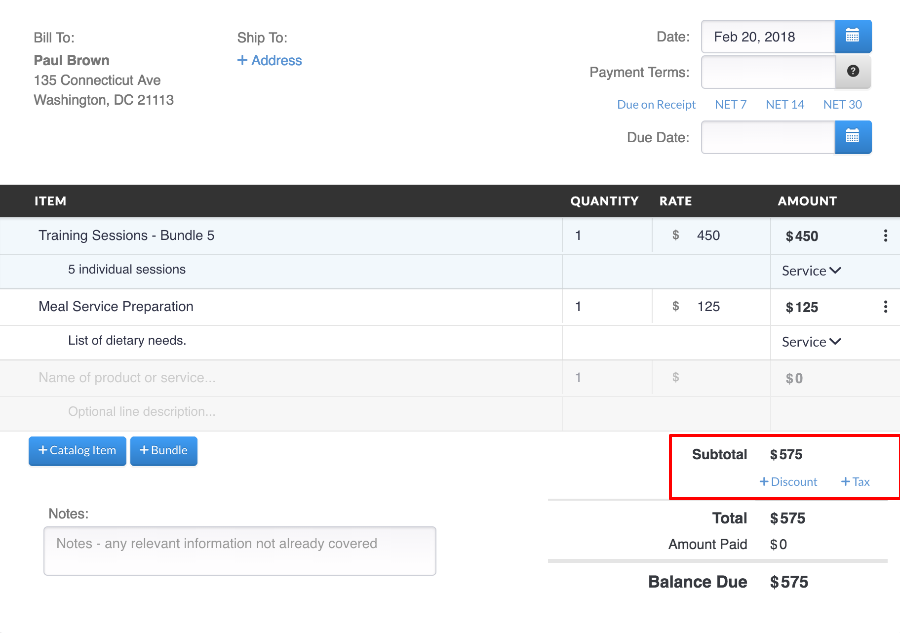
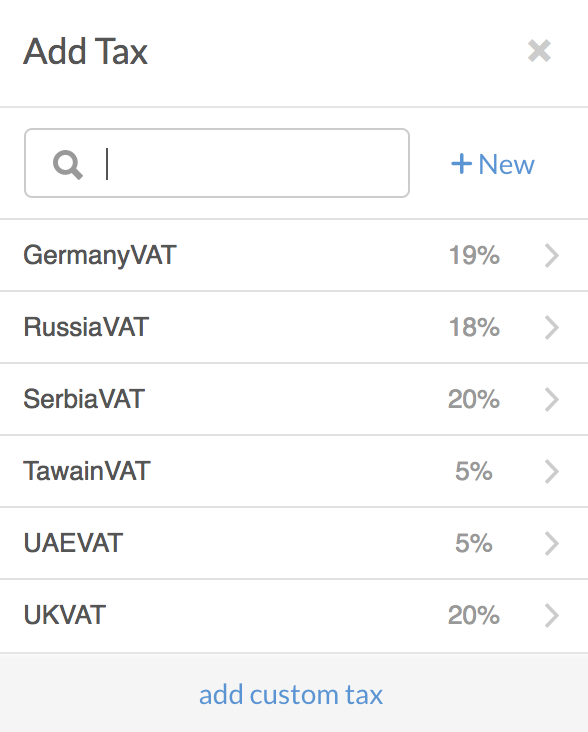

#Tax Rates & Tax Rules

We understand that GST & VAT can be complex, that is why Invoiced created the tax calculation tool. The Tax Rates and Tax Rules settings allow users to manage a customers rate at time of payment that can be applied to any subtotal of an invoice. Invoiced supports both percentages and flat rate tax amounts to be compliant on country tax guidelines. With an easy to use tool, rates and rules can be created within minutes to get your business up and running faster. Lets get started.

To access the Tax Rates and Rules, navigate to **Settings → Taxes**

 

 To access the Tax Rates and Rules, navigate to **Settings → Taxes**

Invoiced will allow the user to create both Tax Rates and Tax Rules.

* Tax Rate: A Tax Rate is the specific rate that will need to be applied based off of the conditions of the Tax Rule. For example: If a customer is from the United Arab Emirates, this customer will need the specific tax rate for their country applied. The Tax Rate will also tell a Tax Rule what to apply, if chosen to use Tax Rules. 

* Tax Rule: A Tax Rule is what encompasses the Tax Rate created. The Tax Rate tells the Tax Rule how much or what percentage of Tax to apply to the invoice.

##Creating a Tax Rate 

To create a new Tax Rate, simply click New Tax Rate. This will prompt the user to add conditions to the Tax Rate. Simply add a name to describe the Tax Rate, and percent of tax that will be applied to the invoice if the Tax Rule is used. Please note: the ID will auto-fill based off of the name of the New Tax Rate. 

##Creating a Tax Rule

As stated, a Tax Rule can be created to further define the scope of Tax Rates. Categories for Tax Rules are based off of the country and/or state at which the customer is purchasing from. This allows the Invoice to easily apply the correct Tax percentage to the customer. 

To create a new Tax Rule, simply click on New Tax Rule. **Please note:** A Tax Rate is needed to create a Tax Rule. 

1. Select the Tax Rate to be applied to the Tax Rule.

2. Select the condition the Tax Rule will apply to:
    a. *Everyone* : This will allow the Tax Rule to be applied to everyone that generates an invoice

    b. *Customers in Specific Country*: This will allow the Tax Rule to be applied to customers in the specific country specified on invoicing.

    c. *Customers in Specific State/Province*: This will allow the Tax Rule to be applied to customers in a specific state or province specified on invoicing. 

##Using a Tax Rate

After creating the Tax Rates and Tax Rules, they are now ready to be applied to Invoicing. A rate or rule can be applied anywhere there is a line item or subtotal. Press the +Tax to Add Tax. A list of the Tax Rates created will be shown. Select the correct Tax Rate that is needed to apply Tax to the Invoice.

Once selected, the rate will be added to the invoice as a line item and tax will be applied to the Balance Due. 

##Applying Custom Tax Rate

Invoiced also allows for custom Tax Rates to be applied on an invoice. Simply press the +Tax line on the invoice and select Add Custom Tax. This will add a field to the invoice to manually enter a flat amount for taxing. 

###FAQ:

Not finding the answer to your Tax question? Here are some frequently asked questions and solutions to further help guide you. 

* *QuickBooks Online User:  The invoice generated by Invoiced is perfect, but when the invoice is being sent to QuickBooks Online, tax is being added on top and leaving the customer with a balance owing. Why is this happening?*
    * Have you checked the settings in your QuickBooks Online? Are your tax settings: tax exclusive or tax inclusive? In the company settings you can choose the default tax setting for invoices. Go to tools > Company Settings > Advanced > Accounting > Default Tax rate Selection. Please select Inclusive of Tax and save.
     
* *Selecting a 0% tax option, but taxes still being applied? *
    * Since some customers in the same location are going to be taxed different rates, you cannot use the global tax rule settings. Otherwise you will see that the global tax rate continues to be applied to your customer. Instead what you should be creating tax rates and rules for specific countries.  When there is a default tax rule, it is applied to every transaction. 

