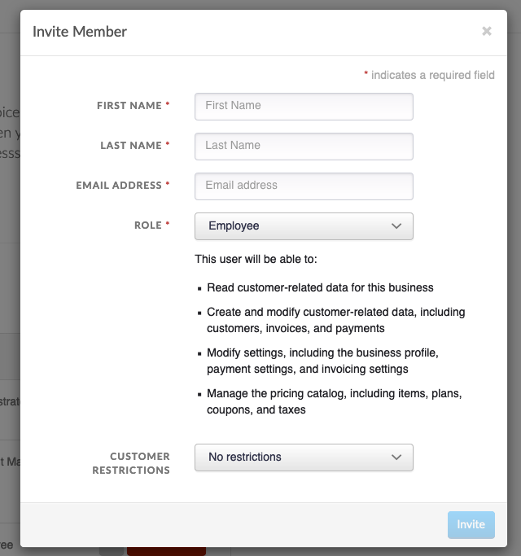
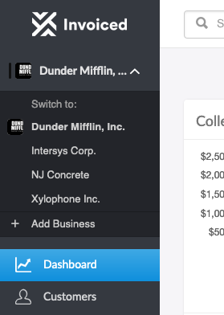
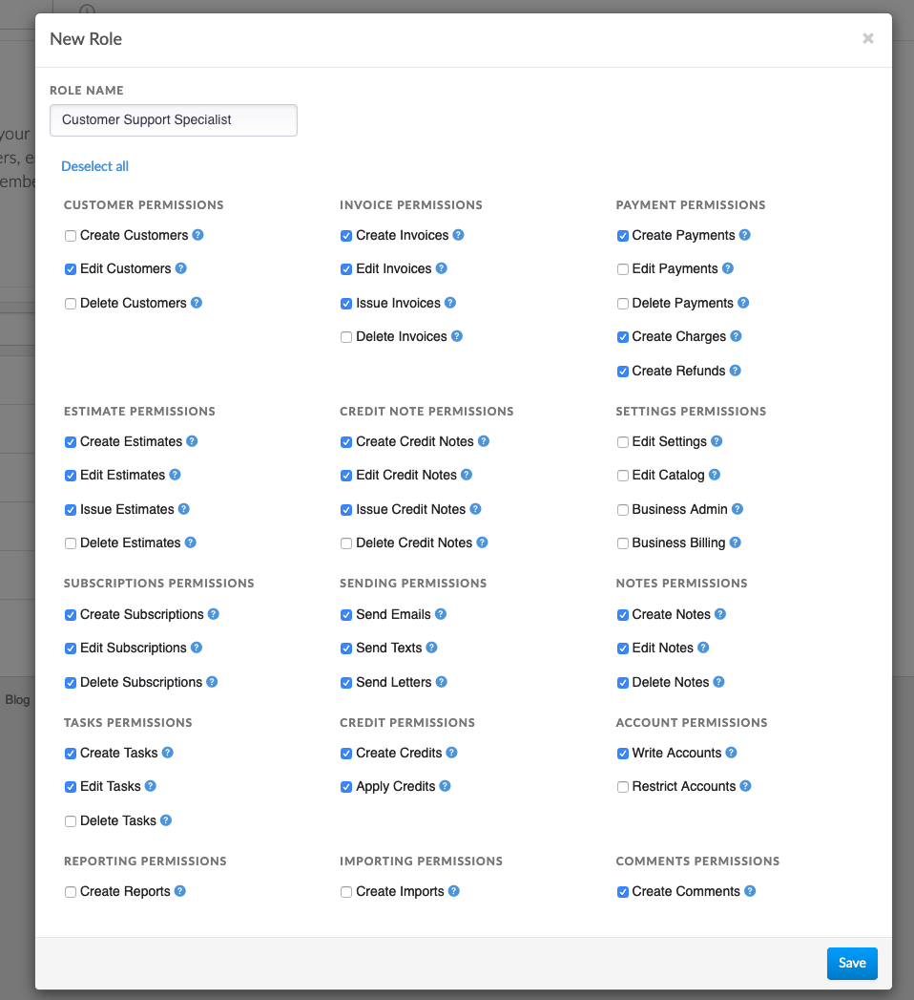
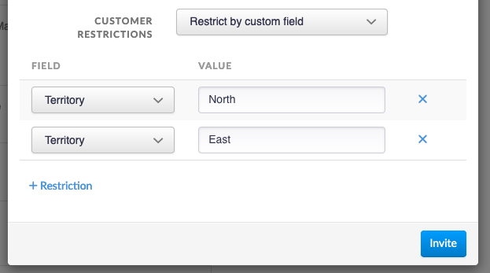

# User Permissions

In this guide we are going to show you how the roles and permissions system works on Invoiced. The permissions system has been designed to give fine-grained control over who has access to your sensitive billing and financial information.

## Adding and Removing Users

Here we are going to walk through adding and removing users from your Invoiced account. Each company on Invoiced has its own set of users that have access to the account. It's important to note that companies are separate from users. This means it is possible for a user to belong to more than 1 company.

User permissions only apply to internal users that are accessing the Invoiced dashboard. The settings chosen here do not have any effect on access to the customer portal.

### Adding Users

1. Go to **Settings** > **Team** in the Invoiced application.

2. Click **Invite Member**.

3. Enter in the basic details of the person you would like to invite.

   

4. Select a [role](#roles) for the user and any [customer restrictions](#customer-restrictions).

### Removing Users

If the time comes to remove a user from your Invoiced account this can easily be done by an administrator.

1. Go to **Settings** > **Team** in the Invoiced application.

2. Find the user you want to remove and click **Revoke Access** next to their name.

3. The user will immediately cease to have access to the account, even if they are already signed in.

### Switching Companies

If a user belongs to more than 1 company, they can easily switch between those various companies without signing out. It's important to keep in mind that no data or settings are shared between companies, even if you belong to multiple companies.

1. Click on your company name in the top-left of the application.

2. Click on the company you want to switch to.

   

## Roles

### Standard Roles

A role dictates what actions a user is allowed to take, for example, creating invoices, issuing a refund, and modifying item prices. Out of the box, Invoiced includes these roles:
- Read-Only - Nothing can be created, modified, or deleted in this role
- Account Manager - This role can only see accounts they created or manage
- Employee - Can perform all billing actions but cannot change any settings
- Administrator - Have full access to Invoiced

### Custom Roles

Customers on the Enterprise edition of Invoiced can create their own roles that have a different set of permissions than the standard roles. This can be used to provide more granular access to the various functions of Invoiced.

#### Creating a Custom Role

1. Go to **Settings** > **Team** > **Roles** in the Invoiced application.

2. Click **New Role**.

3. Give your role a name and choose the permissions available to that role.

   

4. Click **Save**. You can now assign this role to users!

## Customer Restrictions

In addition to restricting what actions a user can take within Invoiced, you can also restrict the customer accounts they can access. Restrictions can be set on each user account to provide additional security and accommodate more advanced access requirements. This means users with the same role could potentially have access to a different set of customers, if needed, depending on their restrictions.

We support the following types of restrictions:

1. **No restrictions** - Users with this setting can see all customer accounts

2. **Restrict by custom field** - Users with this setting can only see customer accounts that have the specified custom field values.

3. **Restrict by account ownership** - Users with this setting can only see customer accounts where they are the account owner.

### Restrict by custom field

The **Restrict by custom field** restriction allows you to use any custom field on the customer level to dictate customer access for a user. For example, you might have a custom field to represent a territory, department, or entity. With custom field restrictions you can easily grant a user access to a list of territories, departments, entities, etc.

When you use this setting you can restrict a user to a list of values for up to 3 custom fields. Users will only be able to see customers that match one of the values in the list for each custom field. If a customer does not have the specified custom field values then this restricted user would not be able to see that customer in the dashboard.

In this example a user has access to all customers that have a **Territory** value of *North* or *East*.

