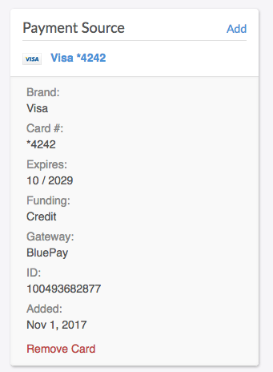

# Payment Gateways

Invoiced supports the most popular payment gateways out of the box.

We support these payment gateways: (click any gateway for documentation)

- [AffiniPay](/docs/integrations/affinipay)
- [Authorize.Net](/docs/integrations/authorizenet)
- [BluePay](/docs/integrations/bluepay)
- [Braintree](/docs/integrations/braintree)
- [Chase Paymentech Orbital](/docs/integrations/chase-paymentech)
- [CyberSource](/docs/integrations/cybersource)
- [Elavon](/docs/integrations/elavon)
- [Intuit QuickBooks Payments](/docs/integrations/intuit-payments)
- [Merchant e-Solutions](/docs/integrations/merchant-e-solutions)
- [Moneris](/docs/integrations/moneris)
- [NMI](/docs/integrations/nmi)
- [Payeezy](/docs/integrations/payeezy)
- [Stripe](/docs/integrations/stripe)
- [USAePay](/docs/integrations/usaepay)
- [Worldpay](/docs/integrations/worldpay)

## Need a payment processor?

We can help you get connected with one of our supported payment processors. Our [payment gateway selector](https://invoiced.com/gateways) can help you find a payment gateway based on your country.

## Questions?

If you do not know which payment gateway to use then please contact your payment processor for help. If you do not see your gateway listed then please contact us at [support@invoiced.com](mailto:support@invoiced.com) to discuss getting it added.

## Switching payment gateways

Switching payment gateways can be challenging, especially when there is payment information stored on your old gateway. We have designed Invoiced to allow you to seamlessly transition between payment gateways without disrupting your customer's billing.

When you switch payment gateways in **Settings** > **Payments**, any new payment information added through Invoiced and any one-off charges will immediately use the new gateway you have selected as the default. When vaulting payment information, Invoiced will always store customer payment information on your payment gateway account. When switching payment gateways, due to PCI compliance reasons, the payment information is not portable between payment gateways.

In order to continue billing and charging your customers without interruption we will continue to use the old payment gateway for any payment information that was stored there prior to the transition. When your customer enters in new payment information then it will be stored on the new payment gateway. You can see which payment gateway a card or bank account is stored on by going to the customer summary page on Invoiced and clicking on the payment source.

### Migrating stored payment information

In some cases payment information can be migrated from your old payment gateway to your new gateway. The two payment gateways providers, old and new, will have to broker the transfer of stored payment information for PCI compliance reasons. You would only need to do this if you have payment information on file with the old gateway that you would like to charge through your new gateway. It is not a requirement to move payment information when switching to a new gateway on Invoiced.

Once you have successfully migrated your customer's payment information to the new payment gateway then we can update the references on Invoiced to point to the new information. Please contact [support@invoiced.com](mailto:support@invoiced.com) for assistance with importing in your updated customer mapping.   