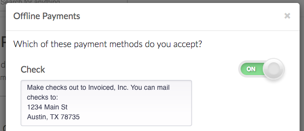
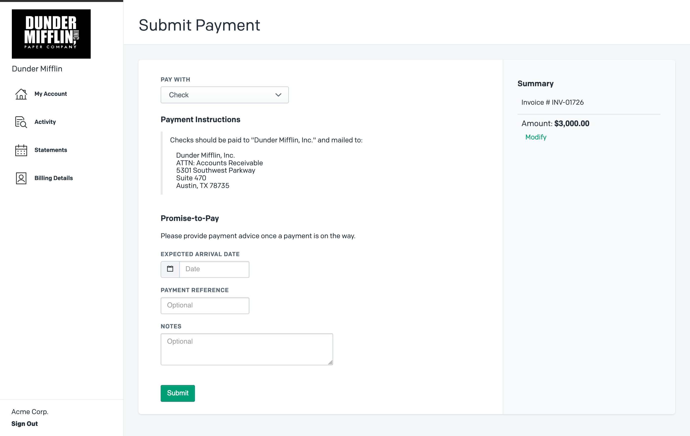

# Cash Application

Invoiced lets you display instructions to your clients on your invoices for offline payment methods you accept, like check and wire transfer. Customers can even notify you through the customer portal when the check is in the mail. When a payment is received outside of Invoiced, we give you tools to apply those incoming payments to outstanding invoices.

## Setup

Setting up offline payments is easy! Follow these steps to display your custom payment instructions to customers.

1. From the Invoiced dashboard go to **Settings** > **Payments**.

   

2. Click **Setup** on the *Offline Payments* payment method.

  

3. Click on the toggle for each payment method you want to accept, like Check or Wire Transfer. Then enter in your payment instructions for that payment method.

  

4. Click **Save** to enable offline payments.

## Client Workflow

When your client selects any of your offline payment methods we will show them your custom payment instructions. They can even notify you when the check is in the mail.

## Recording Offline Payments

Once you receive the payment you will need to record the payment through the dashboard in order to mark the invoice as paid. You can do this by going to the **Payments** section, clicking **Record Payment**, fill in the form, and finally click **Create**.

The form will recognize what invoices are outstanding for the customer and even allow you to intelligently apply the payment across multiple invoices.

Voilà, the invoice is now marked as paid.

## Handling Overpayments

Whenever customers pay electronically Invoiced will always ensure the payment is for the correct amount. However, if you accept offline payments, like checks or wire transfers, it is possible that customers will overpay. We've tried to make handling overpayments as easy as possible.

If your customer pays too much there are two ways it can be handled:

1. **Credit** the customer's balance for use on future invoices

2. Issue a **refund** for the amount overpaid

When you record a payment through the dashboard and there is money left over after applying the amount to any outstanding invoices then we will give you a choice to credit or refund the overpayment amount.

Should you choose to refund the overpayment then we will record a refund on Invoiced, however, actually sending those funds back to your customer will be left up to you since the original payment was not processed through Invoiced.