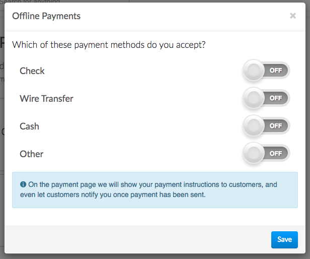

# Offline Payments

Invoiced lets you give instructions to your clients for the offline payments methods you accept. Customers can then notify you when the check is in the mail.

## Setup

Setting up offline payments is easy! Follow these steps to display your custom payment instructions to customers.

1. From the Invoiced dashboard go to **Settings** > **Payments**.

   

2. Click **Setup** on the *Offline Payments* payment method.

  

3. Click on the toggle for each payment method you want to accept, like Check or Wire Transfer. Then enter in your payment instructions for that payment method.

  

4. Click **Save** to enable offline payments.

## Client Workflow

When your client selects any of your offline payment methods we will show them your custom payment instructions. They can even notify you when the check is in the mail.

## Overpayments

Whenever customers pay electronically Invoiced will always ensure the payment is for the correct amount. However, if you accept offline payments, like checks or wire transfers, it is possible that customers will overpay. We've tried to make handling overpayments as easy as possible.

If your customer pays too much there are two ways it can be handled:

1. **Credit** the customer's balance for use on future invoices

2. Issue a **refund** for the amount overpaid

When you record a payment through the dashboard and there is money left over after applying the amount to any outstanding invoices then we will give you a choice to credit or refund the overpayment amount.

Should you choose to refund the overpayment then we will record a refund on Invoiced, however, actually sending those funds back to your customer will be left up to you since the original payment was not electronic.